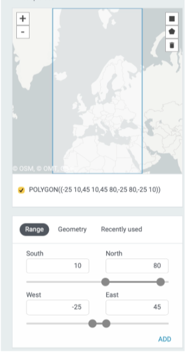
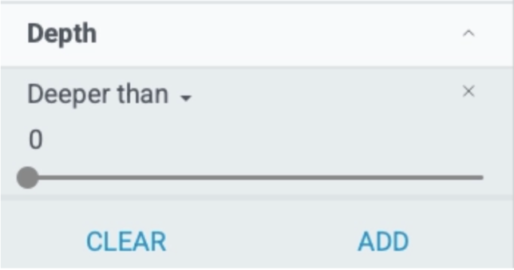
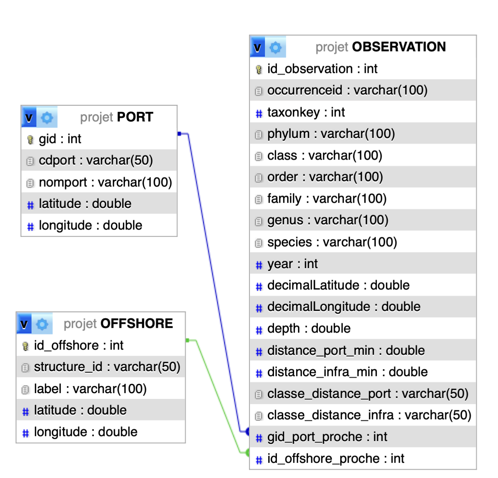
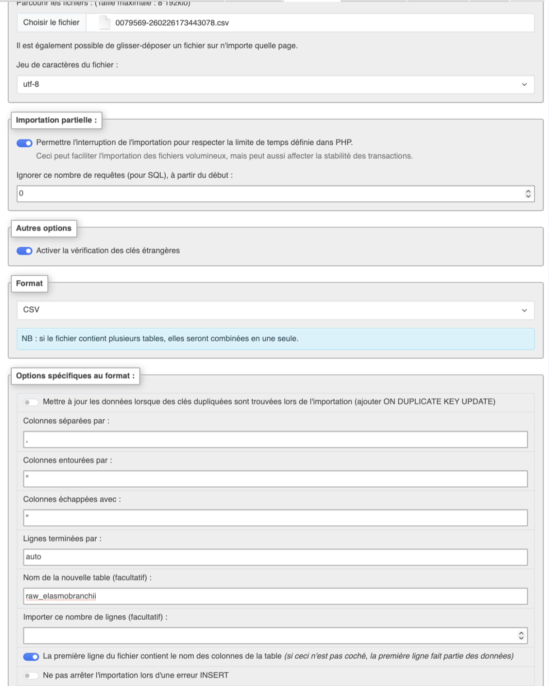

```{r setup, include=FALSE}
knitr::opts_chunk$set(echo = TRUE)
```


# Introduction {.label:s-intro}

## Introduction

La biodiversité marine est aujourd’hui soumise à de nombreuses pressions humaines, notamment liées aux activités portuaires et aux installations offshore. Les ports concentrent une forte activité maritime, logistique et industrielle, tandis que les infrastructures offshore modifient également les espaces marins. Il est donc pertinent de se poser la question suivante:


\bigskip

\begin{center}

\textbf{Dans quelle mesure la proximité des ports maritimes et des infrastructures offshore influence-t-elle la distribution spatiale des observations de biodiversité marine en Europe ?
}

\end{center}
\medskip 

\justifying


Cette problématique s’appuie sur plusieurs sources de données réelles : des occurrences d’espèces marines issues de GBIF(mettre lien), des données géographiques sur les ports maritimes(mettre lien), ainsi que des données sur des infrastructures offshore(mettre lien).

\medskip

L’objectif est de construire une base de données relationnelle permettant de croiser ces informations, puis de réaliser des requêtes SQL afin de dégager des tendances exploitables dans le cadre du cours de Sciences des données 2.

\medskip

Le cadre du projet demande justement d’utiliser plusieurs sources réelles, de les intégrer dans une base relationnelle, puis de les interroger pour produire des tableaux et analyses.

\medskip

Nous avons retenu ces jeux de données car ils permettent de croiser une information biologique, à savoir les occurrences d’espèces marines, avec des informations spatiales décrivant certaines pressions anthropiques. Ce croisement est cohérent avec notre problématique, qui porte sur l’influence potentielle des ports et des infrastructures offshore sur la distribution observée de la biodiversité marine.


## Responsabilités et composition de l’équipe
Dans notre équipe, les taches ont été réparties de la manière suivante:

\medskip

Alban  Gerschheimer: Étudiant n°XXXX, Resp. de l'import de données et des requêtes SQL.

Omar Terras: Étudiant n°XXXX, Resp.

Alfred Gyalay: Étudiant n°XXXX, Resp. du code R.

Mia Portes : Étudiant n°22406297, Resp. du rapport.

# Base de données

## Provenance des données

Nous avons décidé de choisir des datas selon certains critères afin de garder une cohérence lors de cette recherche.

Les critères appliqués sont les suivants :
\begin{itemize}
\item zone : \textbf{Europe maritime}
\item période : \textbf{2010–2026}
\item espèces : \textbf{uniquement 3 grands groupes}
\item observations : \textbf{présentes uniquement}
\item coordonnées : \textbf{obligatoires}
\item problèmes spatiaux : \textbf{exclusion des observations avec un problème géospatial}
\item profondeur : \textbf{plus petit ou égal à 0}
\end{itemize}

{#myfigure width="4cm"}
{#myfigure height="3cm"}


  
  Chaque observation d’espèce sera localisée à l’aide de ses coordonnées géographiques, puis comparée à la position des ports et des infrastructures offshore les plus proches. L’idée est que plus une observation est proche d’un port ou d’une infrastructure, plus elle est susceptible d’être soumise à une pression humaine potentielle. À l’inverse, les observations éloignées seront considérées comme situées dans des zones moins directement influencées.

\bigskip

## Distance entre une observation et un port/plateforme

Pour chaque observation, nous calculerons la distance avec les ports maritimes présents dans notre base.\newline
Si une observation a pour coordonnées (lat_o, lon_o) et un port (lat_p, lon_p), alors on calcule une distance géographique entre les deux points à l'aide de la formule suivante:

$$
d_{port}(o,p)=\sqrt{(lat_o - lat_p)^2 + (lon_o - lon_p)^2}
$$


Cette formule donne une distance euclidienne simplifiée entre une observation o et un port p.

\bigskip

Ensuite, pour chaque observation, on garde seulement la distance au port \textbf{le plus proche}.
On applique la même logique aux infrastructures offshore.
Pour une observation o et une infrastructure i, la distance peut être notée :

$$
d_{infra}(o,i)=\sqrt{(lat_o - lat_i)^2 + (lon_o - lon_i)^2}
$$
Puis on retient la \textbf{distance minimale}.

## Construction de classes de distance

  Afin de rendre l’analyse plus lisible, les distances minimales calculées entre chaque observation et le port ou l’infrastructure offshore les plus proches n’ont pas seulement été conservées sous forme numérique. Elles ont aussi été transformées en classes de proximité, enregistrées dans les variables classe_distance_port et classe_distance_infra.
  
  Dans notre codage, une valeur élevée correspond à une observation plus proche, tandis qu’une valeur faible correspond à une observation plus éloignée. Ce regroupement permet de comparer plus facilement la distribution des observations, le nombre d’espèces distinctes et la répartition des groupes taxonomiques selon le niveau de proximité aux ports et aux infrastructures offshore. Son echelle est de 1 à 10.


## Descriptif des tables
\textbf{REMPLIR LE NOMBRE DE COLONNES ET DE LIGNES}

| Nom colonne     | Type   | Signification                        | Caractéristique                           |
|:---------------:|:------:|:------------------------------------:|:-----------------------------------------:|
| id_espece       | Entier | Identifiant unique de l’espèce       | Clé primaire, unique, non nul             |
| scientific_name | Texte  | Nom scientifique complet de l’espèce | Non unique, non nul                       |
| phylum          | Texte  | Embranchement taxonomique            | Non unique, peut contenir des répétitions |
| classe          | Texte  | Classe taxonomique de l’espèce       | Non unique                                |
| ordre           | Texte  | Ordre taxonomique de l’espèce        | Non unique                                |
| famille         | Texte  | Famille taxonomique de l’espèce      | Non unique                                |
| genre           | Texte  | Genre taxonomique de l’espèce        | Non unique                                |
| nom_espece      | Texte  | Nom spécifique de l’espèce           | Non unique, parfois valeur manquante      |
 

Table: Espece (nombre de lignes $\times$ nombre de colonnes)

| Nom colonne        | Type        | Signification                               | Caractéristique                                 |
|:------------------:|:-----------:|:-------------------------------------------:|:-----------------------------------------------:|
| id_observation     | Entier long | Identifiant unique de l’observation GBIF    | Clé primaire, unique, non nul                   |
| id_espece          | Entier      | Identifiant de l’espèce observée            | Clé étrangère vers ESPECE, non nul              |
| annee              | Entier      | Année de l’observation                      | Non unique, filtrée entre 2010 et 2026          |
| latitude           | Décimal     | Latitude de l’observation                   | Non nulle après nettoyage                       |
| longitude          | Décimal     | Longitude de l’observation                  | Non nulle après nettoyage                       |
| profondeur         | Décimal     | Profondeur de l’observation                 | Peut contenir des valeurs nulles                |
| country_code       | Texte court | Code du pays de l’observation               | Non unique                                      |
| basis_of_record    | Texte       | Type d’enregistrement de l’observation      | Non unique                                      |
| occurrence_status  | Texte       | Statut de présence de l’espèce observée     | Valeur conservée : present                      |
| dataset_key        | Texte       | Identifiant du jeu de données source        | Non unique                                      |

Table: Observation (nombre de lignes $\times$ nombre de colonnes)

| Nom colonne        | Type                 | Signification                         | Caractéristique                                  |
|:------------------:|:--------------------:|:-------------------------------------:|:------------------------------------------------:|
| id_port            | Entier ou texte court| Identifiant unique du port            | Clé primaire, unique, non nul                    |
| code_port          | Texte court          | Code du port lorsqu’il existe         | Peut être unique selon la source, parfois nul    |
| nom_port           | Texte                | Nom du port maritime                  | Non unique dans l’absolu, non nul si conservé    |
| activite_principale| Texte                | Activité principale ou type de port   | Peut contenir des répétitions, peut être nulle   |
| latitude_port      | Décimal              | Latitude du port                      | Non nulle après nettoyage                        |
| longitude_port     | Décimal              | Longitude du port                     | Non nulle après nettoyage                        |

Table: Port (nombre de lignes $\times$ nombre de colonnes)

| Nom colonne     | Type                 | Signification                                   | Caractéristique                           |
|:---------------:|:--------------------:|:-----------------------------------------------:|:-----------------------------------------:|
| id_infra        | Entier ou texte court| Identifiant unique de l’infrastructure offshore | Clé primaire, unique, non nul             |
| type_infra      | Texte                | Type d’infrastructure offshore                  | Non unique                                |
| label           | Texte                | Libellé ou nom de l’infrastructure              | Non unique, peut être descriptif          |
| date_releve     | Date ou texte        | Date du relevé ou de mise à jour                | \textbf{MANQUANT}                         |
| latitude_infra  | Décimal              | Latitude de l’infrastructure                    | Non nulle après nettoyage                 |
| longitude_infra | Décimal              | Longitude de l’infrastructure                   | Non nulle après nettoyage                 |


Table: Infrastructure (nombre de lignes $\times$ nombre de colonnes)

| Nom colonne           | Type                 | Signification                               | Caractéristique                                   |
|:---------------------:|:--------------------:|:-------------------------------------------:|:-------------------------------------------------:|
| id_observation        | Entier long          | Identifiant de l’observation étudiée        | Clé étrangère vers OBSERVATION                    |
| id_X                  | Entier ou texte court| Identifiant de X lié à l’observation        | Clé étrangère vers X                              |
| distance_X            | Décimal              | Distance calculée entre l’observation et X  | Non négative                                      |
| categorie_distance_X  | Texte                | Classe de distance entre l’observation et X | Exemples : très_proche, proche, moyenne, éloignée |

Table: Localiser X (nombre de lignes $\times$ nombre de colonnes)


## Modèle MCD:
  
  {#uml width="7cm" }

## Modèle MOD:


OBSERVATION(id_observation, occurrenceid, taxonkey, phylum, class, order, family, genus, species, year, decimalLatitude, decimalLongitude, depth, distance_port_min, distance_infra_min, classe_distance_port, classe_distance_infra, gid_port_proche#, id_offshore_proche#)

PORT(gid, cdport, nomport, latitude, longitude)

OFFSHORE(id_offshore, structure_id, label, latitude, longitude)

{#uml2 width="8cm" }

## Importation et préparation des données

### Création de la base de données

Dans cette partie nous allons utiliser DBpro et Python ainsi que la  bibliothèque pandas. Avant l’importation des données, une phase de préparation a été réalisée afin de garantir la qualité et la cohérence des informations exploitées.
Une nouvelle base de données nommée **base_maritime_europeenne** a été créée.

{#uml width="7cm" }

### Importation et organisation des tables

Les différentes tables ont ensuite été importées dans la base de données.

{#uml width="5cm" }

Après importation, les tables ont été renommées comme suit :

* elasmobranchii_europe
* cnidaria_europe
* malacostraca_europe
* port_maritime_eur
* offshore_europe


### Création des clés primaires

Certaines tables ne possédaient pas de clé primaire fiable et contenaient des doublons.
Afin d’assurer l’intégrité des données, des identifiants techniques auto-incrémentés ont été ajoutés.

Exemple :

```sql
ALTER TABLE cnidaria_europe
ADD COLUMN id_obs INT NOT NULL AUTO_INCREMENT PRIMARY KEY FIRST;
```

## Nettoyage des données biologiques

### Filtrage des années d’observation

Les observations incohérentes ont été supprimées, notamment :

* les années en dehors de l’intervalle [2010 ; 2026]
* les années manquantes

```sql
DELETE FROM cnidaria_europe
WHERE `year` < 2010 OR `year` > 2026 OR `year` IS NULL;
```

### Filtrage des coordonnées géographiques

Les observations avec coordonnées invalides ont été supprimées :

* latitude hors de [-90 ; 90]
* longitude hors de [-180 ; 180]
* valeurs manquantes

```sql
DELETE FROM cnidaria_europe
WHERE decimalLatitude < -90 
   OR decimalLatitude > 90
   OR decimalLongitude < -180 
   OR decimalLongitude > 180
   OR decimalLatitude IS NULL
   OR decimalLongitude IS NULL;
```

### Création de la table d’observations

Une table unifiée a été construite afin de regrouper les différentes observations biologiques.

```sql
CREATE TABLE observation_europe AS
SELECT occurrenceid, taxonkey, `year`, decimalLatitude, decimalLongitude, depth, datasetkey,
       phylum, `class`, `order`, family, genus, species
FROM cnidaria_europe

UNION ALL

SELECT occurrenceid, taxonkey, `year`, decimalLatitude, decimalLongitude, depth, datasetkey,
       phylum, `class`, `order`, family, genus, species
FROM elasmobranchii_europe

UNION ALL

SELECT occurrenceid, taxonkey, `year`, decimalLatitude, decimalLongitude, depth, datasetkey,
       phylum, `class`, `order`, family, genus, species
FROM malacostraca_europe;
```

Ajout d’une clé primaire :

```sql
ALTER TABLE observation_europe
ADD COLUMN id_observation INT NOT NULL AUTO_INCREMENT PRIMARY KEY FIRST;
```


## Préparation des données géographiques

### Traitement des données offshore

Le fichier offshore initial étant volumineux (environ 120 Mo), un prétraitement a été réalisé en Python (bibliothèque pandas) afin de limiter les données à une zone européenne.

Zone géographique utilisée :

* longitude : [-25 ; 45]
* latitude : [10 ; 80]

{#uml width="7cm" }

Le fichier final obtenu est : **offshore_europe.csv**


### Nettoyage des ports et offshore

Suppression des entrées sans coordonnées :

```sql
DELETE FROM port_maritime_eur
WHERE latitude IS NULL OR longitude IS NULL;
```

## Calcul des distances

### Ajout des variables de distance

De nouvelles colonnes ont été ajoutées pour mesurer la proximité des observations :

```sql
ALTER TABLE observation_europe
ADD COLUMN distance_port_min DECIMAL(12,6),
ADD COLUMN distance_infra_min DECIMAL(12,6),
ADD COLUMN classe_distance_port VARCHAR(30),
ADD COLUMN classe_distance_infra VARCHAR(30);
```


### Distance aux port et infrastructures offshore

Nous avons utilisé une distance euclidienne simplifiée entre les coordonnées de l’observation et celles des ports et fait de même pour les infrastructures offshore:

```sql
UPDATE observation_europe 
SET distance_infra_min = (
    SELECT MIN(
        SQRT(
            POW(observation_europe.decimalLatitude - offshore_europe.latitude, 2) +
            POW(observation_europe.decimalLongitude - offshore_europe.longitude, 2)
        )
    )
    FROM offshore_europe 
);
```


### Construction des classes de distance

Les distances ont été regroupées en classes :

```sql
UPDATE observation_europe
SET classe_distance_port =
    CASE
        WHEN distance_port_min < 0.01 THEN 10
        WHEN distance_port_min < 0.02 THEN 9
        WHEN distance_port_min < 0.03 THEN 8
        WHEN distance_port_min < 0.05 THEN 7
        WHEN distance_port_min < 0.07 THEN 6
        WHEN distance_port_min < 0.10 THEN 5
        WHEN distance_port_min < 0.15 THEN 4
        WHEN distance_port_min < 0.20 THEN 3
        WHEN distance_port_min < 0.30 THEN 2
        ELSE 1
    END;
```


### Liaison avec les infrastructures offshore

On crée alors une liaison entre les 2 en ajoutant le port le plus proche et en liant les collones en FK.

```sql
UPDATE observation_europe o
SET id_offshore_proche = (
    SELECT i.id_offshore
    FROM offshore_europe i
    ORDER BY 
        ((o.decimalLatitude - i.latitude) * (o.decimalLatitude - i.latitude)) +
        ((o.decimalLongitude - i.longitude) * (o.decimalLongitude - i.longitude))
    LIMIT 1
);
```

Ajout de la clé étrangère :

```sql
ALTER TABLE observation_europe
ADD CONSTRAINT fk_obs_offshore
FOREIGN KEY (id_offshore_proche) REFERENCES offshore_europe(id_offshore);
```
---

## Analyse des données

L’objectif de cette analyse est d’étudier l’influence de la proximité aux ports sur la répartition des observations biologiques.

### Distance moyenne au port par phylum

Cette requête permet de calculer la distance moyenne des observations par phylum, afin d’identifier les groupes biologiques les plus proches ou éloignés des infrastructures portuaires.

```sql
SELECT phylum, AVG(distance_port_min) AS distance_port_moyenne
FROM observation_europe
GROUP BY phylum;
```
{#uml width="7cm" }

###  Répartition des observations selon la distance au port

On analyse ici le nombre d’observations en fonction des classes de distance aux ports, ce qui permet de visualiser la distribution spatiale des données.

```sql
SELECT classe_distance_port, COUNT(*) AS nb_observations
FROM observation_europe
GROUP BY classe_distance_port
ORDER BY classe_distance_port;
```
{#uml width="7cm" }


###  Nombre d’espèces distinctes selon la distance au port

Cette requête met en évidence la pression exercée par les infrastructures

```sql
SELECT classe_distance_port, COUNT(DISTINCT species) AS nb_especes_distinctes
FROM observation_europe
WHERE species IS NOT NULL
GROUP BY classe_distance_port
ORDER BY classe_distance_port;
```

{#uml width="7cm" }


### Distance moyenne au port par classe taxonomique

Analyse de la distance moyenne aux ports selon les classes taxonomiques.

```sql
SELECT `class`, AVG(distance_port_min) AS distance_port_moyenne
FROM observation_europe
WHERE `class` IS NOT NULL
GROUP BY `class`
ORDER BY distance_port_moyenne;
```

{#uml width="7cm" }

### Espèces les plus observées à proximité immédiate des ports

Identification des espèces les plus fréquentes dans les zones très proches des ports (classe 10).

```sql
SELECT species, COUNT(*) AS nb_observations
FROM observation_europe
WHERE species IS NOT NULL
  AND classe_distance_port = 10
GROUP BY species
ORDER BY nb_observations DESC
LIMIT 20;
```

### Espèces les plus observées loin des ports

Analyse équivalente pour les zones les plus éloignées des ports (classe 1).

```sql
SELECT species, COUNT(*) AS nb_observations
FROM observation_europe
WHERE species IS NOT NULL
  AND classe_distance_port = 1
GROUP BY species
ORDER BY nb_observations DESC
LIMIT 20;
```

### Nombre d’observations par année

Permet d’étudier l’évolution temporelle du nombre d’observations.

```sql
SELECT `year`, COUNT(*) AS nb_observations
FROM observation_europe
GROUP BY `year`
ORDER BY `year`;
```
{#uml width="7cm" }


### Phylums proches des ports avec un nombre significatif d’observations

On sélectionne les phylums ayant au moins 20 observations afin d’assurer une certaine robustesse statistique.

```sql
SELECT phylum,
       AVG(distance_port_min) AS distance_port_moyenne,
       COUNT(*) AS nb_observations
FROM observation_europe
WHERE phylum IS NOT NULL
GROUP BY phylum
HAVING COUNT(*) >= 20
ORDER BY distance_port_moyenne ASC;
```

{#uml width="7cm" }

###  Association des observations avec le port le plus proche

Jointure entre les observations et la table des ports pour récupérer le nom du port le plus proche.

```sql
SELECT 
    o.id_observation,
    o.species,
    o.distance_port_min,
    p.nomport
FROM observation_europe o
INNER JOIN port_maritime_eur p
    ON o.gid_port_proche = p.gid;
```

### Observations situées à une distance inférieure à la moyenne

Sélection des observations plus proches des ports que la moyenne globale.

```sql
SELECT 
    id_observation,
    species,
    distance_port_min
FROM observation_europe
WHERE distance_port_min < (
    SELECT AVG(distance_port_min)
    FROM observation_europe
);
```


### Phylums abondants et proches des ports

Identification des phylums ayant un nombre important d’observations (>= 100) et une distance moyenne faible aux ports.

```sql
SELECT 
    phylum,
    COUNT(*) AS nb_observations,
    AVG(distance_port_min) AS distance_port_moyenne
FROM observation_europe
WHERE phylum IS NOT NULL
GROUP BY phylum
HAVING COUNT(*) >= 100
ORDER BY distance_port_moyenne ASC;
```
{#uml width="7cm" }

## Quelques détails techniques


On peut interagir avec une base de données directement depuis RMarkdown : i.e. requêter puis récupérer et afficher le résultat directement depuis le Rmd. Un fichier connexionBDD.Rmd est fourni pour donner des exemples.

# Matériel et Méthodes

## Logiciels

Lister tous les logiciels utilisés pour la partie statistique du rapport (et également ceux pour gérer et communiquer entre les membres du projet s'il y en a en particulier)

\medskip

R (ou Python) est le logiciel à privilégier pour la Science des Données. Pour assurer une reproductibilité maximale, vous devriez utiliser R Markdown (ou un Notebook Jupyter, et éventuellement un outil de gestion des versions tel que `Git`), par exemple via Google Colab ou RStudio dans les nuages. Évitez d'utiliser Word!

\bigskip

Il est de votre responsabilité de donner les versions des logiciels que vous utilisez, ainsi que de donner des informations techniques sur l'ordinateur qui vous a servi pour les analyses (système d'exploitation, vitesse du processeur, etc.). Penser à fournir des citations pour les logiciels utilisés, par exemple \footnote{L'entrée BibTeX ajoutée dans le fichier \texttt{references.bib} a été obtenue grâce à la commande  \texttt{citation(package = "tidyverse")} tapée dans la console de R.}.
 


## Modélisation statistique

Quels outils ou méthodes de statistiques allez-vous utiliser? Donner des équations mathématiques s'il y a lieu et lister les éventuels présupposés («assumptions» en anglais) que vous devez faire sur les données afin d'utiliser ces outils ou méthodes (_e.g._, normalité, absence de valeurs aberrantes, etc.).

Il est également bon d'indiquer quelles sont les avantages et les limites de ces méthodes.

Vous pourrez consulter avec profit les Chapitre 11--13 du livre sur R :

<http://biostatisticien.eu/springeR/livreR.pdf>

# Analyse Exploratoire des Données

Toute étude impliquant des données doit **obligatoirement** inclure une analyse exploratoire préalable. Celle-ci permet de mieux comprendre l'information contenue dans les données.

Il faut produire de nombreux résumés graphiques (_e.g._, histogrammes, nuages de points, boxplots, etc.) et numériques (_e.g._, médiane, moyenne, variance, etc.). Ainsi, il faut faire une analyse descriptive uni- et bivariée systématique de toutes les variables du jeu de données. Puis, il faut uniquement conserver les plus pertinents (les autres pouvant être gardés en Annexe), c'est-à-dire ceux qui permettront de dégager des éléments de réponse pour la question de recherche envisagée.  Chaque figure et tableau doit être commenté. Mais il ne faut pas extrapoler et dire des choses qui ne sont pas visibles dans ces graphiques ou tableaux. Pour chaque analyse, vous pourrez préciser le nombre d'individus/ d'unités statistiques concernés au total.

Vous pourrez consulter avec profit le Chapitre 9 du livre sur R :

<http://biostatisticien.eu/springeR/livreR.pdf>

## Utiliser R {.fragile}

Il est facile d'inclure des codes R dans votre rapport, qui seront exécutés à la volée (_i.e._, lors de la traduction de votre fichier `Rmd` en fichier `PDF` ou `DOC`). Par exemple:

```{r, fig.cap="\\label{fig:boxplots}Deux boxplots.", out.width = "7cm", fig.align = "center"}
boxplot(cars, col = c("#5975a4", "#cc8963"))
colMeans(cars)
```


Les lignes de code ne doivent pas dépasser dans la marge de droite. Ainsi on pourrait remplacer le chunk ci-dessous:

```{r, fig.cap = "Pas super.", out.width = "7cm", fig.align = "center"}
boxplot(cars, main = "Un titre qui est vraiment beaucoup trop long et qui dépasse dans la marge de droite")
```

par celui-ci:

\tiny

```{r, fig.cap = "Déjà mieux.", out.width = "7cm", fig.align = "center"}
boxplot(cars, 
        main = "Un titre qui est vraiment beaucoup trop long\n mais qui ne dépasse plus dans la marge de droite")
```

\normalsize

où l'on a:

- utilisé la commande \LaTeX\ `\tiny` pour changer la taille de la police (suivi de de `\normalsize` pour revenir à la taille normale), 
- mis l'instruction `main = ...` sur la deuxième ligne,
- utilisé `\n` pour afficher le titre sur deux lignes.

\vspace{3em}

**Remarques** : Contrairement aux graphiques précédents, nous vous demandons, pour effectuer les graphiques, d'utiliser le package `ggplot2`. Voir [https://juba.github.io/tidyverse/08-ggplot2.html](https://juba.github.io/tidyverse/08-ggplot2.html) pour une courte introduction.

# Inférence statistique et modélisation

Dans cette partie, vous pourrez utiliser les outils et méthodes vus au semestre précédent pour analyser les liens entre les variables. 

Pour cela, vous pourrez utiliser les tests du $\chi^2$, test du coefficient de corrélation linéaire, test d'Anova, la droite de régression linéaire.

Vous pourrez également proposer des modèles pour faire du clustering (k-means, CAH), de la classification (K plus proches voisins par exemple) comme vu en Science des données 1.  

## La droite de régression linéaire : un premier exemple

Si on souhaite expliquer les variations d'une variables réponse $Y$ en fonction d'un certain nombre de prédicteurs $x_1,\ldots,x_p$, on peut utiliser un modèle de régression linéaire simple ($p=1$) ou multiple ($p>1$)

$$
Y_i = \beta_0 + \beta_1 x_{1i} + \cdots +\beta_p x_{pi} + \epsilon_i, \qquad i=1,\ldots,n.
$$
où l'on présuppose que les $\epsilon_i$ sont i.i.d.\ $N(0,1)$ pour tout $i=1,\ldots,n$ ($n$ étant la taille de l'échantillon).

Vous pourrez toujours consulter avec profit les Chapitre 11--13 du livre sur R :

<http://biostatisticien.eu/springeR/livreR.pdf>

Ces chapitres détaillent l'utilisation de certains tests et modèles sous `R`.

# Discussion

Placer les résultats que vous avez obtenus dans le chapitre précédent en perspective par rapport au problème étudié.

# Conclusion et perspectives {.label:ccl}

Quelles sont les conclusions principales? Quelles sont vos recommandations pour le commanditaire? Quelles analyses subséquentes pourraient être faites dans le futur?

\bigskip

On attend de vous deux types de perspectives : des perspectives à court terme pour améliorer rapidement votre approche et des perspectives à plus long terme qu'elles soient liées à la science des données ou au domaine métier pour lequel vous avez travaillé.

\bigskip

Lister également les difficultés rencontrées dans la partie BD (e.g., taille de la base, manque de données, ...) et dans la partie statistique.

# Bibliographie {-}

<div id="refs"></div>

\bibliographystyle{elsarticle-harv}
\bibliography{references}

# Annexes {-}


Il faut utiliser les annexes de façon judicieuse. C'est ici que l'on place des résultats trop volumineux pour apparaître dans le corps du rapport. Ou bien des résultats (e.g., graphiques) moins intéressants que les autres. Cela permet de limiter le nombre de pages du coeur du rapport, et d'ajouter des détails dans cette partie pour le lecteur désireux d'en savoir plus.

## **Codes** {-}

Ajouter vos codes informatique ici. Les codes doivent être correctement indentés et commentés.

## **Tables** {-}

Si vous avez des tableaux supplémentaires, vous pouvez les ajouter ici.

Utiliser https://www.tablesgenerator.com/markdown_tables pour créer des tables Markdown simples, ou bien utiliser \LaTeX.

1. Table Markdown

| Les tables   |        sont       |  cool |
|--------------|:-----------------:|------:|
| col 1 est    |  alignée à gauche | $1600 |
| col 2 est    |     centrée       |   $12 |
| col 3 est    | alignée à droite  |    $1 |

Table: une légende au-dessus du tableau. \label{tab7.1}

Aligner les nombres de la troisième colonne sur la droite permet d'afficher les unités au-dessus des unités, les dizaines au-dessus des dizaines, etc. Il faut toujours privilégier cette présentation.

\vspace{3em}

2. Table Latex

\begin{table}[h]
\centering
\caption{une légende au-dessus du tableau}
\label{tab7.1}
\begin{tabular}{lcr}
\hline
Les tables & sont & cool \\
\hline
col 1 est & alignée à gauche & 1600 \\
col 2 est & centrée & 12 \\
col 3 est & alignée à droite & 1 \\
\hline
\end{tabular}
\end{table}


\textbf{Remarques}

\begin{itemize}
  \item \{lcr\} : gauche (l), centré (c), droite (r)
  \item \verb|\caption| place la légende au-dessus
  \item \verb|\label| permet de référencer le tableau (\verb|\ref{tab7.1}|)
  \item Les nombres sont bien alignés à droite dans la 3\ieme{} colonne
\end{itemize}
