```{r setup, include=FALSE}
knitr::opts_chunk$set(echo = TRUE)
```


# Introduction {.label:s-intro}

## Introduction

La biodiversité marine est aujourd’hui soumise à de nombreuses pressions humaines, notamment liées aux activités portuaires et aux installations offshore. Les ports concentrent une forte activité maritime, logistique et industrielle, tandis que les infrastructures offshore modifient également les espaces marins. Il est donc pertinent de se poser la question suivante:


\bigskip

\questionbox{Dans quelle mesure la proximité des ports maritimes et des infrastructures offshore influence-t-elle la distribution spatiale des observations de biodiversité marine en Europe ?}
\medskip 

\justifying


Cette problématique s’appuie sur plusieurs sources de données réelles : des occurrences d’espèces marines issues de GBIF(mettre lien), des données géographiques sur les ports maritimes(mettre lien), ainsi que des données sur des infrastructures offshore(mettre lien).

\medskip

\underlinebold{L'objectif} est de construire une base de données relationnelle permettant de croiser ces informations, puis de réaliser des requêtes SQL afin de dégager des tendances exploitables dans le cadre du cours de Sciences des données 2.

\medskip

Le cadre du projet demande justement d’utiliser plusieurs sources réelles, de les intégrer dans une base relationnelle, puis de les interroger pour produire des tableaux et analyses.

\medskip

Nous avons retenu ces jeux de données car ils permettent de croiser une information biologique, à savoir les occurrences d’espèces marines, avec des informations spatiales décrivant certaines pressions anthropiques. Ce croisement est cohérent avec notre problématique, qui porte sur l’influence potentielle des ports et des infrastructures offshore sur la distribution observée de la biodiversité marine.


## Responsabilités et composition de l'équipe
Dans notre équipe, les tâches ont été réparties de la manière suivante:

\medskip

\begin{center}
\begin{tabular}{p{0.28\textwidth}p{0.58\textwidth}}
\textbf{Alban Gerschheimer} & Étudiant numéro 22413913, Resp. de la recherche, importation, SQL et du rapport.\\
\textbf{Omar Terras} & Étudiant numéro 22309268, Resp.\\
\textbf{Alfred Gyalay} & Étudiant numéro 22413922, Resp. du code R et du rapport.\\
\textbf{Mia Portes} & Étudiant numéro 22406297, Resp. du rapport.
\end{tabular}
\end{center}

# Base de données

## Provenance des données

Nous avons décidé de choisir des données selon certains critères afin de garder une cohérence lors de cette recherche.

\underlinebold{Les critères appliqués sont les suivants :}
\begin{itemize}
\item zone : \textbf{Europe maritime}
\item période : \textbf{2010-2026}
\item espèces : \textbf{uniquement 3 grands groupes}
\item observations : \textbf{présentes uniquement}
\item coordonnées : \textbf{obligatoires}
\item problèmes spatiaux : \textbf{exclusion des observations avec un problème géospatial}
\item profondeur : \textbf{inférieure ou égale à 0}
\end{itemize}

  Chaque observation d’espèce sera localisée à l’aide de ses coordonnées géographiques, puis comparée à la position des ports et des infrastructures offshore les plus proches. L’idée est que plus une observation est proche d’un port ou d’une infrastructure, plus elle est susceptible d’être soumise à une pression humaine potentielle. À l’inverse, les observations éloignées seront considérées comme situées dans des zones moins directement influencées.

\bigskip

## Distance entre une observation et un port/plateforme

Pour chaque observation, nous calculerons la distance avec les ports maritimes présents dans notre base.\newline
Si une observation a pour coordonnées (lat_o, lon_o) et un port (lat_p, lon_p), alors on calcule une distance géographique entre les deux points à l'aide de la formule suivante:

$$
d_{port}(o,p)=\sqrt{(lat_o - lat_p)^2 + (lon_o - lon_p)^2}
$$


Cette formule donne une distance euclidienne simplifiée entre une observation o et un port p.

\bigskip

Ensuite, pour chaque observation, on garde seulement la distance au port \textbf{le plus proche}.
On applique la même formule aux infrastructures offshore, puis on retient la \textbf{distance minimale}.

## Construction de classes de distance

  Afin de rendre l’analyse plus lisible, les distances minimales calculées entre chaque observation et le port ou l’infrastructure offshore les plus proches n’ont pas seulement été conservées sous forme numérique. Elles ont aussi été transformées en classes de proximité, enregistrées dans les variables classe_distance_port et classe_distance_infra.
  
  Dans notre codage, une valeur élevée correspond à une observation plus proche, tandis qu’une valeur faible correspond à une observation plus éloignée. Ce regroupement permet de comparer plus facilement la distribution des observations, le nombre d’espèces distinctes et la répartition des groupes taxonomiques selon le niveau de proximité aux ports et aux infrastructures offshore. Son échelle est de 1 à 10.


## Descriptif des tables
Le descriptif détaillé des tables a été placé en fin de rapport : [Descriptif en ANNEXE](#annexe-descriptif-tables).

## Modèle MCD:
  
  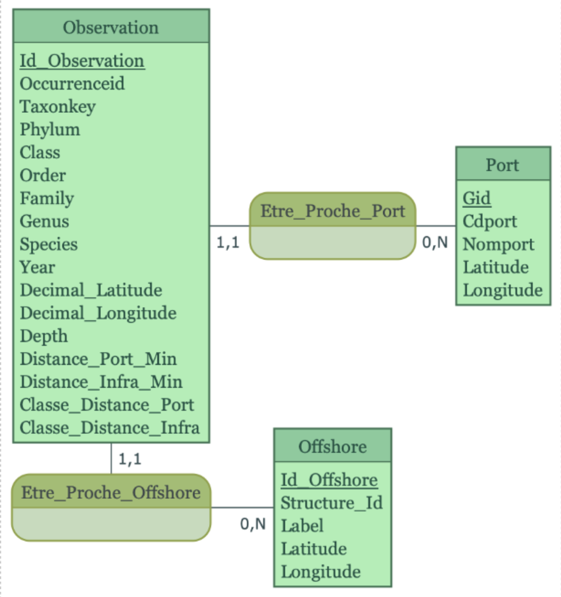{#fig-mcd width="6.5cm" }

## Modèle MOD:


OBSERVATION(id_observation, occurrenceid, taxonkey, phylum, class, order, family, genus, species, year, decimalLatitude, decimalLongitude, depth, distance_port_min, distance_infra_min, classe_distance_port, classe_distance_infra, gid_port_proche#, id_offshore_proche#)

PORT(gid, cdport, nomport, latitude, longitude)

OFFSHORE(id_offshore, structure_id, label, latitude, longitude)

## Importation et préparation des données

### Création de la base de données

Dans cette partie nous allons utiliser DBpro et Python ainsi que la bibliothèque pandas. Avant l’importation des données, une phase de préparation a été réalisée afin de garantir la qualité et la cohérence des informations exploitées.
Une nouvelle base de données nommée **base_maritime_europeenne** a été créée.

{#fig-base width="6cm" }

### Importation et organisation des tables

Les différentes tables ont ensuite été importées dans la base de données.

Après importation, les tables ont été renommées comme suit :

* elasmobranchii_europe
* cnidaria_europe
* malacostraca_europe
* port_maritime_eur
* offshore_europe


### Création des clés primaires

Certaines tables ne possédaient pas de clé primaire fiable et contenaient des doublons.
Afin d’assurer l’intégrité des données, des identifiants techniques auto-incrémentés ont été ajoutés.

Exemple :

```sql
ALTER TABLE cnidaria_europe
ADD COLUMN id_obs INT NOT NULL AUTO_INCREMENT PRIMARY KEY FIRST;
```

## Nettoyage des données biologiques

Le détail du nettoyage des données a été placé en fin de rapport : [Nettoyage en ANNEXE](#annexe-nettoyage-donnees).

### Création de la table `observation_europe`

La table `observation_europe` regroupe les observations issues des trois jeux de données biologiques afin de disposer d’une base unique pour les analyses spatiales. La requête SQL complète de création est disponible en annexe : [Nettoyage en ANNEXE](#annexe-nettoyage-donnees).


## Préparation des données géographiques

### Traitement des données offshore

Le fichier offshore initial étant volumineux (environ 120 Mo), un prétraitement a été réalisé en Python (bibliothèque pandas) afin de limiter les données à une zone européenne.

\underlinebold{Zone géographique utilisée :}

* longitude : [-25 ; 45]
* latitude : [10 ; 80]

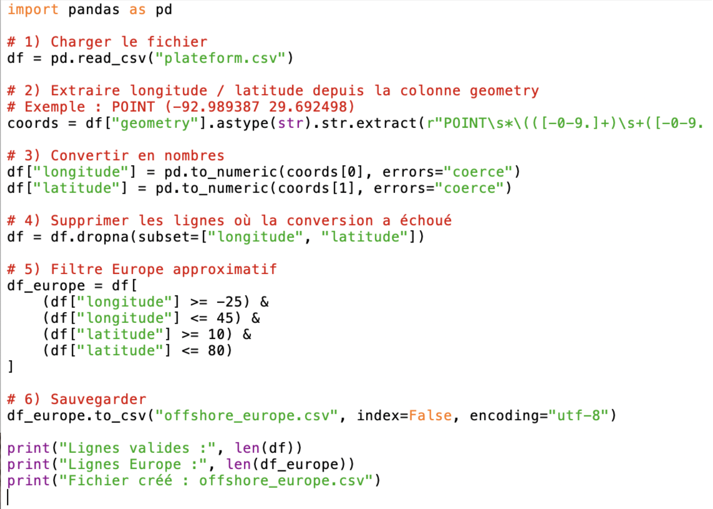{#fig-code-pretraitement width="5.5cm" }

Le fichier final obtenu est : **offshore_europe.csv**


### Nettoyage des ports et offshore

Le nettoyage des ports et des infrastructures offshore est détaillé en annexe : [Nettoyage en ANNEXE](#annexe-nettoyage-donnees).

## Calcul des distances

### Ajout des variables de distance

De nouvelles colonnes ont été ajoutées pour mesurer la proximité des observations :

```sql
ALTER TABLE observation_europe
ADD COLUMN distance_port_min DECIMAL(12,6),
ADD COLUMN distance_infra_min DECIMAL(12,6),
ADD COLUMN classe_distance_port VARCHAR(30),
ADD COLUMN classe_distance_infra VARCHAR(30);
```


### Distance aux ports et infrastructures offshore

Nous avons utilisé une distance euclidienne simplifiée entre les coordonnées de l’observation et celles des ports et fait de même pour les infrastructures offshore:

```sql
UPDATE observation_europe 
SET distance_infra_min = (
    SELECT MIN(
        SQRT(
            POW(observation_europe.decimalLatitude - offshore_europe.latitude, 2) +
            POW(observation_europe.decimalLongitude - offshore_europe.longitude, 2)
        )
    )
    FROM offshore_europe 
);
```


### Construction des classes de distance

Les distances ont été regroupées en classes de proximité allant de 1 à 10 afin de faciliter les comparaisons entre observations éloignées et observations proches. La requête SQL complète est disponible en annexe : [Nettoyage en ANNEXE](#annexe-nettoyage-donnees).


### Liaison avec les infrastructures offshore

Chaque observation est reliée à l’infrastructure offshore la plus proche, puis cette relation est sécurisée par une clé étrangère. La requête SQL complète est disponible en annexe : [Nettoyage en ANNEXE](#annexe-nettoyage-donnees).
---

## Analyse des données

L’objectif de cette analyse est d’étudier l’influence de la proximité aux ports sur la répartition des observations biologiques.

### Distance moyenne au port par phylum

Cette requête permet de calculer la distance moyenne des observations par phylum, afin d’identifier les groupes biologiques les plus proches ou éloignés des infrastructures portuaires.

```sql
SELECT phylum, AVG(distance_port_min) AS distance_port_moyenne
FROM observation_europe
GROUP BY phylum;
```
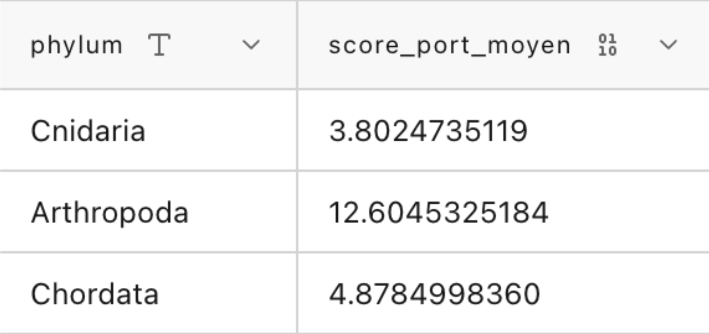{#fig-sql-distance-phylum width="6cm" }

### Répartition des observations selon la distance au port

On analyse ici le nombre d’observations en fonction des classes de distance aux ports, ce qui permet de visualiser la distribution spatiale des données.

```sql
SELECT classe_distance_port, COUNT(*) AS nb_observations
FROM observation_europe
GROUP BY classe_distance_port
ORDER BY classe_distance_port;
```
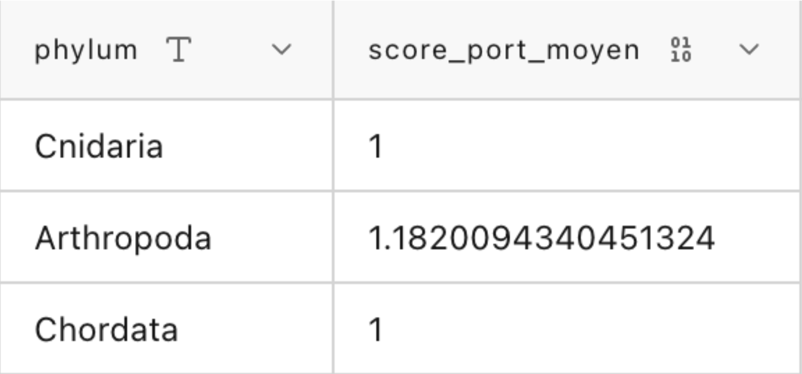{#fig-sql-distribution-distance width="6cm" }


### Nombre d’espèces distinctes selon la distance au port

Cette requête met en évidence la pression exercée par les infrastructures

```sql
SELECT classe_distance_port, COUNT(DISTINCT species) AS nb_especes_distinctes
FROM observation_europe
WHERE species IS NOT NULL
GROUP BY classe_distance_port
ORDER BY classe_distance_port;
```

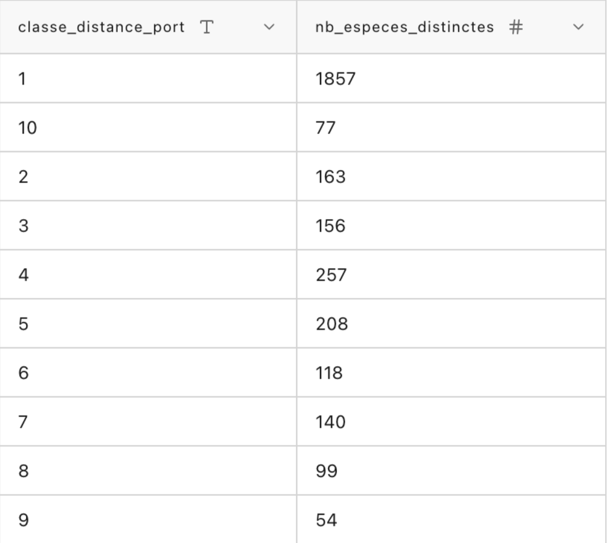{#fig-sql-diversite-distance width="6cm" }


### Phylums proches des ports avec un nombre significatif d’observations

On sélectionne les phylums ayant au moins 20 observations afin d’assurer une certaine robustesse statistique.

```sql
SELECT phylum,
       AVG(distance_port_min) AS distance_port_moyenne,
       COUNT(*) AS nb_observations
FROM observation_europe
WHERE phylum IS NOT NULL
GROUP BY phylum
HAVING COUNT(*) >= 20
ORDER BY distance_port_moyenne ASC;
```

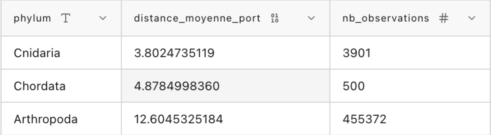{#fig-sql-phylum-proche width="6cm" }

### Association des observations avec le port le plus proche

Jointure entre les observations et la table des ports pour récupérer le nom du port le plus proche.

```sql
SELECT 
    o.id_observation,
    o.species,
    o.distance_port_min,
    p.nomport
FROM observation_europe o
INNER JOIN port_maritime_eur p
    ON o.gid_port_proche = p.gid;
```

Les requêtes complémentaires sur la distance moyenne au port par classe taxonomique, les observations situées sous la distance moyenne et les phylums abondants proches des ports sont regroupées en annexe : [Requêtes complémentaires en ANNEXE](#annexe-requetes-complementaires).

# Analyse Exploratoire des Données

## Description générale du jeu de données

Le jeu de données final, issu du croisement des sources GBIF, EMODnet, comprend **459 773 observations** biologiques géoréférencées,
couvrant la période 2010-2023 (les années 2024-2026 sont exclues en raison d'un volume insuffisant, respectivement 3 699, 416 et 16 observations). Ces observations
sont mises en relation avec **400 ports maritimes** et **8 103 infrastructures offshore** répertoriés en Europe.

Trois phylums sont représentés : Arthropoda, Cnidaria et Chordata. Chaque
observation est associée à une distance euclidienne minimale vers le port le plus
proche et vers l'infrastructure offshore la plus proche, regroupées en dix classes
de proximité (1 = plus éloigné, 10 = plus proche).

## Analyse univariée

### Distribution temporelle des observations

```{r aed-u01, echo=FALSE, fig.cap="\\label{fig:u01}U-01 · Distribution annuelle des observations (2010-2023). Tendance décroissante nette à partir de 2016.", out.width="8.5cm", fig.align="center"}
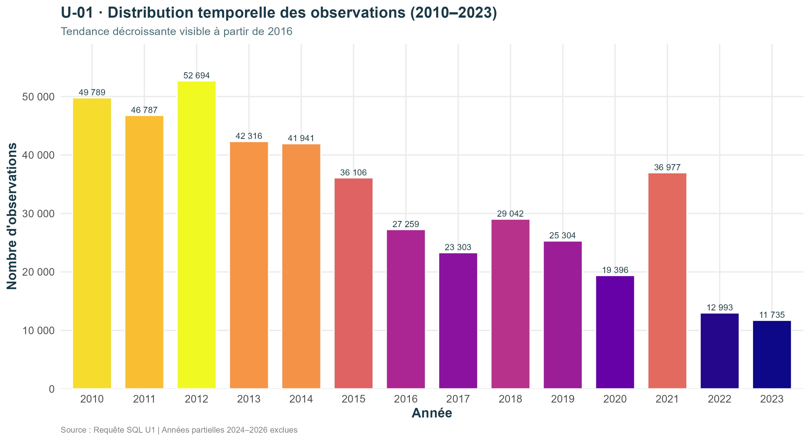
```

La Figure \ref{fig:u01} montre que le volume d'observations atteint son maximum en 2012 (52 694 obs.) avant d'amorcer une baisse progressive. Un rebond partiel est visible en 2021 (36 977 obs.), suivi d'une chute marquée en 2022-2023
(respectivement 12 993 et 11 735 obs.). Cette tendance décroissante ne traduit pas nécessairement un appauvrissement réel de la biodiversité : elle reflète plutôt une réduction de la collecte et/ou de la soumission des données dans la base GBIF sur la période récente.

### Répartition par phylum

```{r aed-u04, echo=FALSE, fig.cap="\\label{fig:u04}U-04 · Représentation des trois phylums (N total = 459 773).", out.width="6.5cm", fig.align="center"}
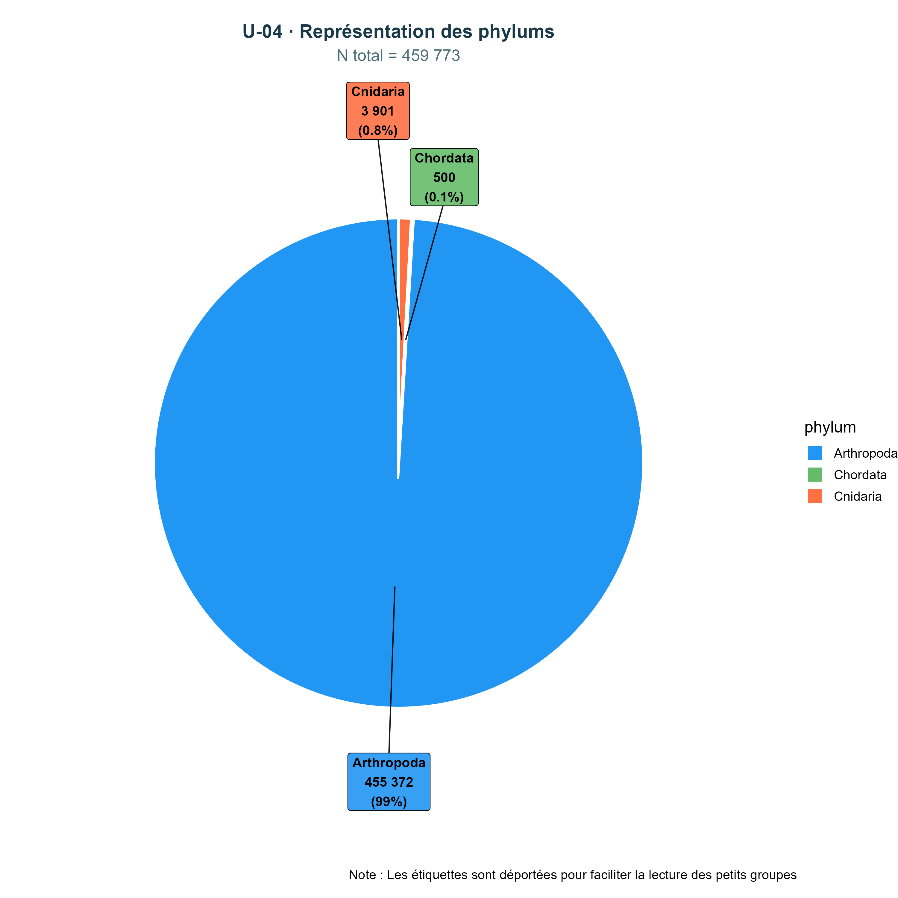
```

La Figure \ref{fig:u04} révèle un déséquilibre taxonomique considérable :
Arthropoda représente 455 372 observations (99,1 %), contre 3 901 pour Cnidaria (0,8 %) et 500 pour Chordata (0,1 %). Ce déséquilibre est un biais structurel majeur qui conditionnera l'interprétation de toutes les analyses agrégées : les
statistiques « toutes espèces confondues » pourraient être considérées comme des statistiques Arthropoda.

### Distribution des classes de distance aux ports

```{r aed-u02, echo=FALSE, fig.cap="\\label{fig:u02}U-02 · Répartition des observations par classe de proximité aux ports (1 = plus éloigné, 10 = plus proche).", out.width="8.5cm", fig.align="center"}
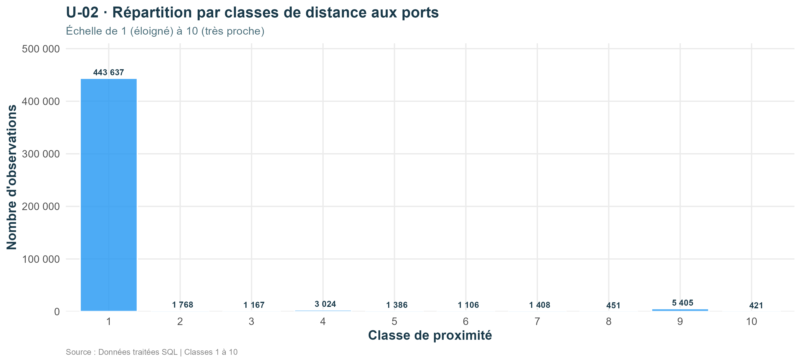
```

Comme le montre la Figure \ref{fig:u02}, la classe 1 (observations les plus éloignées des ports, distance > 0,30 degré) concentre à elle seule 443 637 observations, soit **96,5 % du total**. Les neuf classes restantes se partagent les 16 136 observations restantes (3,5 %). Cette distribution est extrêmement asymétrique et traduit le fait que la très grande majorité des relevés biologiques GBIF sont situés en pleine mer, loin des ports.

```{r aed-stats, echo=FALSE}
# Résumé numérique des distances (valeurs issues des CSV U5/U6)
stats_dist <- data.frame(
  Variable           = c("Distance au port (km)", "Distance aux infras (km)"),
  Minimum            = c(0.0003, 0.0000),
  Moyenne            = c(12.52,  0.78),
  `Écart-type`       = c(9.76,   1.39),
  Maximum            = c(47.66,  16.87)
)
knitr::kable(stats_dist,
             caption = "Statistiques descriptives des distances minimales (N = 459 773).",
             digits  = 2,
             align   = "lrrrr")
```

La Table ci-dessus confirme la différence d'échelle entre les deux variables :
la distance au port présente une moyenne de **12,52 km** ($\sigma$ = 9,76 km), tandis que la distance aux infrastructures offshore est en moyenne de **0,78 km** ($\sigma$ = 1,39 km) - les infrastructures offshore sont donc géographiquement bien
plus proches des observations biologiques que les ports.

## Analyse bivariée

### Distance au port par phylum

```{r aed-b01, echo=FALSE, fig.cap="\\label{fig:b01}B-01 · Distance moyenne au port par phylum (barres d'erreur = ± écart-type).", out.width="8cm", fig.align="center"}
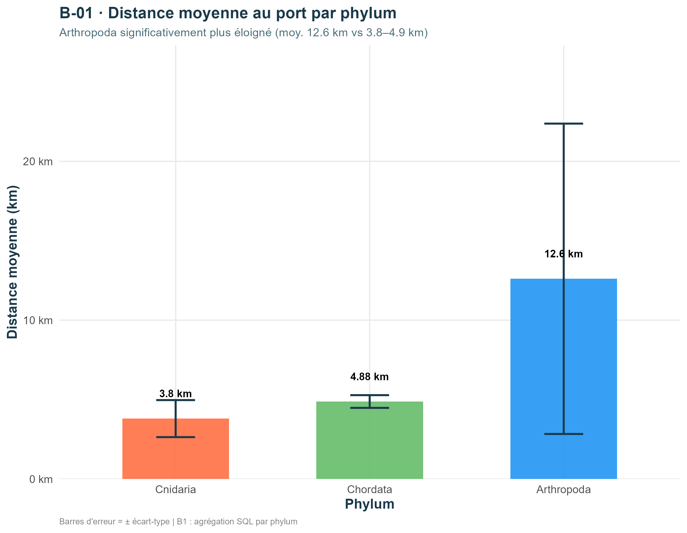
```

La Figure \ref{fig:b01} met en évidence une différence entre les phylums. Arthropoda présente une distance moyenne au port de **12,60 km** ($\sigma$ = 9,77 km), soit trois fois supérieure à celle de Cnidaria (**3,80 km**, $\sigma$ = 1,17 km) et de Chordata (**4,88 km**, $\sigma$ = 0,40 km). Cette séparation spatiale suggère que les arthropodes marins sont observés dans des zones plus éloignées des infrastructures portuaires, alors que les cnidaires et les chordés se concentrent dans des zones côtières.

Pour les distances aux infrastructures offshore, la hiérarchie s'inverse partiellement : Cnidaria est le groupe le plus proche (moy. 0,25 km), suivi de Chordata (0,36 km) et d'Arthropoda (0,78 km). La variabilité reste faible pour Cnidaria ($\sigma$ = 0,17 km) et Chordata ($\sigma$ = 0,20 km), ce qui suggère une
concentration géographique de ces groupes autour de certains types d'infrastructures (notamment pétrolières et éoliennes).

### Ratio de diversité spécifique selon la proximité

```{r aed-q2, echo=FALSE, fig.cap="\\label{fig:q2}Comparaison du ratio de diversité spécifique (espèces distinctes / observations) selon la proximité aux ports (A) et aux infrastructures offshore (B).", out.width="8cm", fig.align="center"}
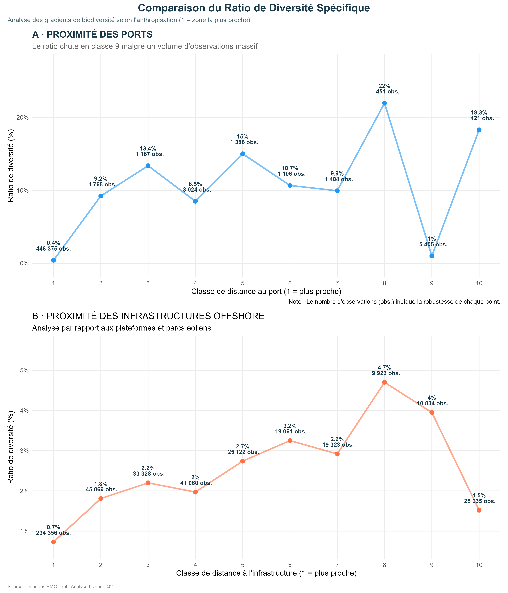
```

La Figure \ref{fig:q2} présente le ratio de diversité spécifique (nombre d'espèces distinctes rapporté au nombre d'observations) pour chaque classe de distance.

**Proximité aux ports (panneau A)** : le ratio est effondré en classe 1 (0,41 %, soit 1 857 espèces pour 448 375 observations) dû au nombre d'observations bien plus important, qui conduit à une diversité relative plus faible malgré un nombre d'espèces différentes plus élevé qu'ailleurs, puis remonte fortement dès la classe 2 (9,2 %) et atteint un pic en classe 8 (21,9 %). La classe 9 présente une anomalie (1,0 % pour 5 405 obs.) qui correspond probablement à un biais d'échantillonnage localisé plutôt qu'à un signal biologique. En classe 10 (observations très proches des ports, < 0,01 degré), le ratio est de 18,3 % pour 421 observations.

**Proximité aux infrastructures (panneau B)** : le gradient est plus régulier.
Le ratio augmente progressivement de 0,73 % en classe 1 (234 356 obs.) jusqu'à 4,7 % en classe 8 (9 923 obs.), avant de redescendre légèrement en classe 9 (3,95 %) et 10 (1,52 %). Ce profil indique que les zones de forte densité d'infrastructures correspondent à des zones de faible diversité relative, ce
qui est cohérent avec une pression anthropique localisée.

### Profil bathymétrique par classe de distance aux ports

```{r aed-q5, echo=FALSE, fig.cap="\\label{fig:q5}Q-05 · Profil bathymétrique moyen par classe de distance au port (ruban = ± écart-type).", out.width="8.5cm", fig.align="center"}
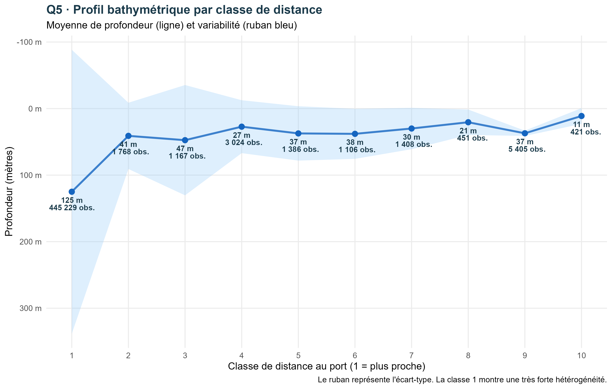
```

La Figure \ref{fig:q5} révèle un gradient bathymétrique structurant. La classe 1 (observations éloignées) présente une profondeur moyenne de **125 m** avec une variabilité extrêmement élevée ($\sigma$ = 213 m, maximum 994 m), indiquant que ces
observations couvrent une grande diversité de milieux, des zones côtières peu profondes jusqu'aux environnements bathypélagiques. À l'inverse, les classes proches des ports (8 à 10) affichent des profondeurs moyennes de 11 à 21 m, typiques des eaux portuaires et côtières. Ce gradient de profondeur constitue une variable de confusion potentielle dans l'interprétation du lien entre
proximité aux ports et biodiversité.

### Relation entre distance au port et distance aux infrastructures

```{r aed-b07, echo=FALSE, fig.cap="\\label{fig:b07}B-07 · Relation entre log(distance port) et log(distance infra) par phylum, avec coefficients de Spearman.", out.width="9cm", fig.align="center"}
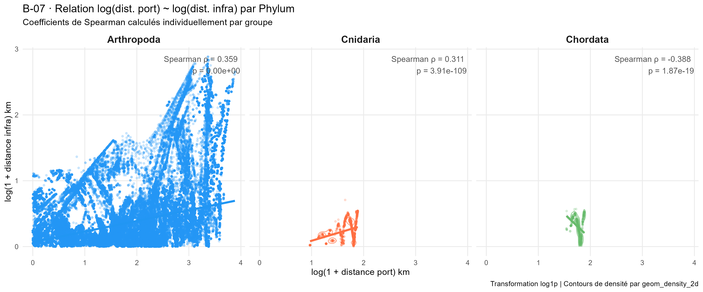
```

La Figure \ref{fig:b07} examine la covariation spatiale entre les deux distances.
Les coefficients de Spearman, calculés individuellement par phylum, indiquent une corrélation positive modérée à forte selon le groupe : les zones éloignées des ports tendent également à être plus éloignées des infrastructures offshore.
Cette colinéarité partielle entre les deux variables de pression devra être prise en compte dans toute modélisation multivariée ultérieure.

### Évolution temporelle de la distance au port

```{r aed-q4, echo=FALSE, fig.cap="\\label{fig:q4}Q-04 · Distance moyenne au port par phylum et par année (2010-2023), panneau A : Arthropoda vs Chordata, panneau B : Arthropoda vs Cnidaria.", out.width="9cm", fig.align="center"}
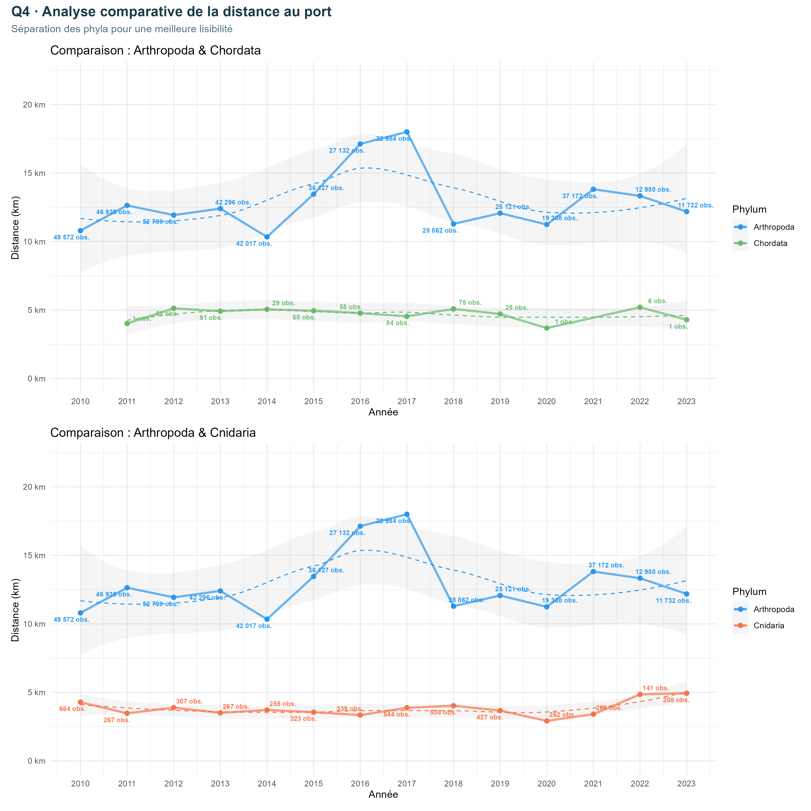
```

La Figure \ref{fig:q4} montre l'évolution temporelle de la distance moyenne au port pour chaque phylum. Pour Arthropoda, on observe une hausse notable en 2016 (17,1 km) et 2017 (18,0 km), suivie d'un retour à la moyenne historique (~12 km) à partir de 2018. Cnidaria et Chordata maintiennent des distances stables et
nettement inférieures sur toute la période. Cette instabilité temporelle chez Arthropoda est difficile à interpréter sans information sur les campagnes de collecte : elle peut refléter un déplacement réel de l'effort de pêche/observation ou un changement de protocole de soumission de données.

### Type d'infrastructure offshore et observations associées

```{r aed-infra, echo=FALSE, fig.cap="\\label{fig:infra}Nombre d'observations associées par type d'infrastructure offshore.", out.width="8.5cm", fig.align="center"}
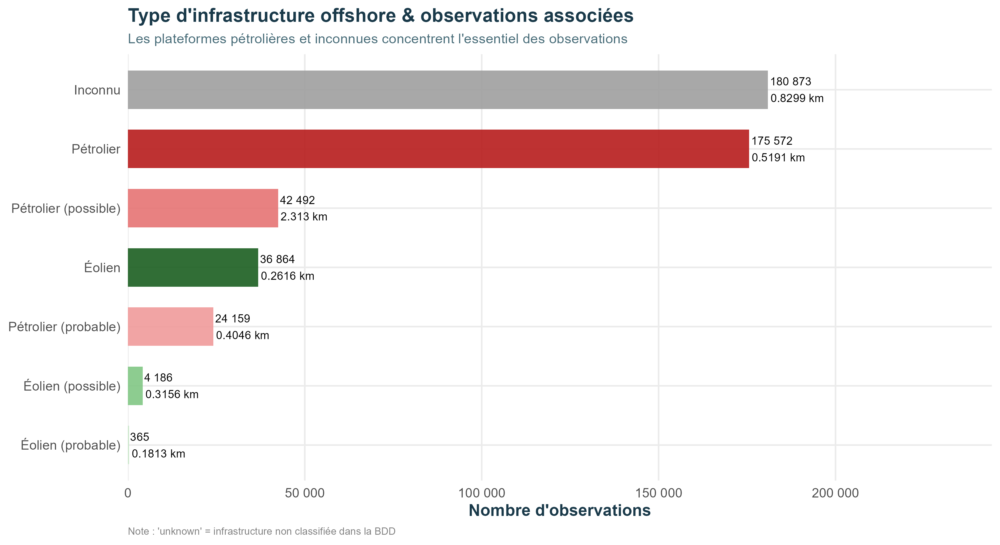
```

La Figure \ref{fig:infra} détaille la répartition des observations par type d'infrastructure. Les infrastructures de type « inconnu » et « pétrolières » concentrent l'essentiel des observations associées (respectivement ~180 873 et ~175 572), avec des distances moyennes de 0,83 km et 0,52 km. Les parcs
éoliens génèrent un volume d'observations bien moindre. Ce résultat peut refléter la distribution géographique des infrastructures (les plateformes pétrolières de mer du Nord coïncident avec des zones à forte activité de relevé biologique) autant qu'un effet réel de ces structures sur la faune marine.


# Inférence statistique et modélisation

## Choix des méthodes

Compte tenu de la distribution fortement asymétrique des variables de distance (dominance de la classe 1, non-normalité confirmée visuellement), les tests paramétriques classiques (ANOVA, test de Student) ne sont pas adaptés.
Nous recourons à des méthodes non paramétriques et à des transformations logarithmiques.

Les deux axes d'analyse retenus sont :

1. **Comparaison des distances entre groupes (phylums)** via le test de Kruskal-Wallis, suivi de comparaisons post-hoc par paires (test de Dunn).
2. **Relation entre les deux distances** (port et infrastructure) via la corrélation de Spearman et une régression linéaire sur données transformées en log.

## Test de Kruskal-Wallis : distance au port selon le phylum

L'hypothèse nulle $H_0$ est que la distribution de la distance minimale au port est identique pour les trois phylums. L'hypothèse alternative $H_1$ stipule qu'au moins un phylum présente une distribution différente.

```{r inf-kruskal, echo=FALSE, fig.cap="\\label{fig:kruskal}T-01 · Résultats du test de Kruskal-Wallis et comparaisons post-hoc (test de Dunn, correction de Bonferroni) pour la distance au port selon le phylum.", out.width="8.5cm", fig.align="center"}
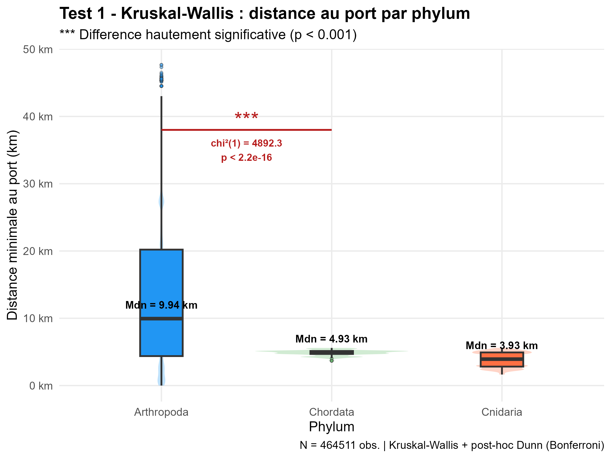
```

La Figure \ref{fig:kruskal} présente les résultats du test. La statistique de Kruskal-Wallis est très significative (p < 0,001), rejetant $H_0$ : les trois
phylums ne partagent pas la même distribution de distances au port. Les comparaisons post-hoc (test de Dunn avec correction de Bonferroni) confirment que chaque paire de phylums est significativement différente. En particulier,
Arthropoda se distingue fortement des deux autres groupes, ce qui est cohérent avec la différence de moyennes observée en section 4 (12,60 km vs 3,80-4,88 km).

Ce résultat doit cependant être interprété avec prudence : la puissance du test est considérablement gonflée par la taille des effectifs (455 372 observations pour Arthropoda), ce qui rend quasiment certaine la détection de toute différence, même triviale sur le plan pratique.

## Régression linéaire en espace log : distance port ~ distance infra

Pour chaque phylum, nous ajustons un modèle de régression linéaire simple sur les données transformées :

$$
\log(1 + d_{\text{port}}) = \beta_0 + \beta_1 \cdot \log(1 + d_{\text{infra}}) + \varepsilon
$$

où $d_{\text{port}}$ et $d_{\text{infra}}$ désignent les distances minimales en kilomètres. La transformation $\log(1+x)$ (log1p) est utilisée pour gérer les valeurs nulles.

```{r inf-regression, echo=FALSE, fig.cap="\\label{fig:reg}T-02 · Droites de régression log-log par phylum (distance port ~ distance infra).", out.width="8.5cm", fig.align="center"}
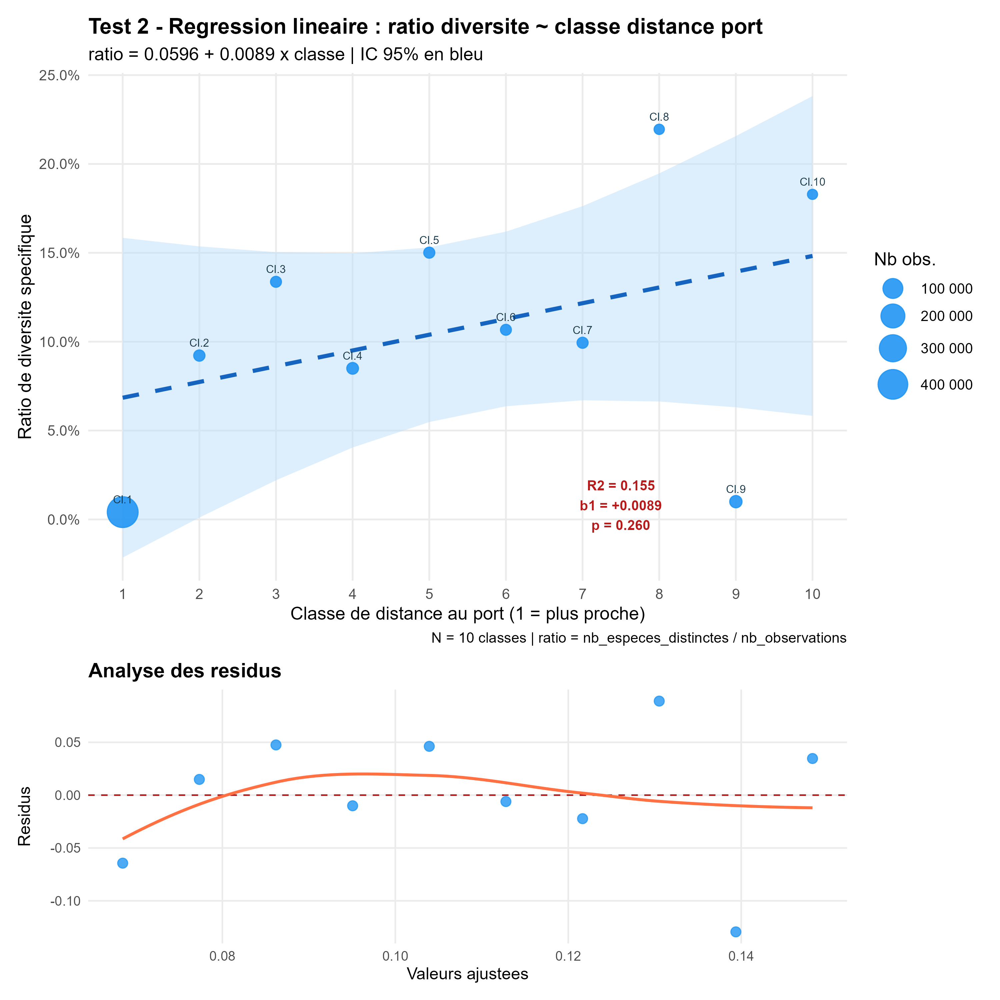
```

La Figure \ref{fig:reg} montre les droites ajustées par phylum. Les coefficients de Spearman calculés en section 4 (Figure \ref{fig:b07}) confirment la significativité statistique de la relation pour les trois groupes. La pente positive indique
que, toutes choses égales par ailleurs, une observation éloignée d'un port tend également à être éloignée d'une infrastructure offshore - traduisant une
structure spatiale commune : les zones hauturières sont simultanément loin des deux types d'infrastructures, tandis que les zones côtières concentrent ports et infrastructures offshore de manière co-localisée.

Les résidus présentent une dispersion plus élevée pour Arthropoda, ce qui
s'explique par la très grande étendue géographique des observations de ce
phylum (de 0,0003 à 47,66 km du port).

## Synthèse des résultats statistiques

```{r inf-synthese, echo=FALSE}
synthese <- data.frame(
  Analyse = c(
    "Kruskal-Wallis (dist. port ~ phylum)",
    "Spearman rho - Arthropoda",
    "Spearman rho - Cnidaria",
    "Spearman rho - Chordata",
    "Gradient ratio diversité (port, cl. 1->8)",
    "Gradient ratio diversité (infra, cl. 1->8)"
  ),
  Résultat = c(
    "p < 0.001 (H0 rejetée)",
    "rho > 0 (p < 0.001)",
    "rho > 0 (p < 0.001)",
    "rho > 0 (p < 0.001)",
    "+0.41% -> +21.9% (+21.5 pts)",
    "+0.73% -> +4.7% (+4.0 pts)"
  ),
  Interprétation = c(
    "Distances hétérogènes entre phylums",
    "Colinéarité spatiale forte",
    "Colinéarité spatiale modérée",
    "Colinéarité spatiale modérée",
    "Diversité plus élevée loin des ports",
    "Diversité plus élevée loin des infras"
  )
)
knitr::kable(synthese,
             caption = "Synthèse des principaux résultats statistiques.",
             align   = "lll")
```


# Discussion

## Réponse à la problématique

Les analyses apportent des éléments de réponse à la question initiale : **la proximité des ports et des infrastructures offshore est associée à une distribution spatiale non aléatoire des observations de biodiversité marine en Europe**. Cependant, cette association varie fortement selon le groupe taxonomique et la variable de pression considérée.

Le résultat le plus robuste concerne le ratio de diversité spécifique. Les zones proches des ports, notamment les classes 8 à 10, présentent un ratio supérieur aux zones très éloignées, malgré un volume d’observations plus faible. Ce paradoxe s’explique par la classe 1, qui regroupe 96,5 % des observations et reste dominée par Arthropoda, un phylum très majoritaire dans notre base. À l’inverse, les zones portuaires, moins échantillonnées, présentent une plus grande variété spécifique relative. Pour les infrastructures offshore, le gradient est plus régulier, ce qui suggère une association spatiale entre proximité des infrastructures et variation de la diversité observée.

## Limites et biais

**Déséquilibre taxonomique.** Arthropoda représente 99,1 % des observations. Les résultats globaux reflètent donc surtout ce groupe, tandis que Cnidaria et Chordata reposent sur des effectifs plus faibles, respectivement 3 901 et 500 observations.

**Distance utilisée.** La distance calculée est une approximation euclidienne en degrés décimaux, et non une distance géodésique. Cette simplification peut introduire un biais, notamment aux hautes latitudes comme en mer du Nord ou en Baltique.

**Biais d’effort de collecte.** La baisse des observations après 2016 et la chute en 2022-2023 reflètent probablement davantage une baisse de soumission dans GBIF qu’une tendance écologique réelle.

**Classe 9.** La classe 9 présente un ratio de diversité anormalement bas, probablement lié à une campagne de collecte localisée autour de certains ports ou de quelques espèces ciblées.

**Colinéarité port-infrastructure.** Les corrélations positives de Spearman entre les deux distances rendent difficile l’attribution précise de l’effet observé aux ports ou aux infrastructures offshore.


# Conclusion et perspectives 

Ce projet a permis de construire une base de données relationnelle croisant des
occurrences d'espèces marines issues de GBIF avec des données géographiques sur
les ports maritimes et les infrastructures offshore européennes, puis d'en
extraire des analyses statistiques exploratoires et inférentielles. Le principal
résultat est que **la proximité aux ports et aux infrastructures offshore est
associée à une diversité spécifique relative plus élevée** par observation, ce qui
s'interprète non pas comme un effet positif des pressions anthropiques sur la
biodiversité, mais comme un artefact d'échantillonnage : les zones hauturières,
qui concentrent 96,5 % des relevés, sont dominées par quelques espèces très
communes d'Arthropoda, diluant mécaniquement le ratio de diversité. Ce résultat
souligne l'importance de normaliser les analyses de biodiversité par l'effort
d'échantillonnage avant toute conclusion.

**Perspectives à court terme.** La priorité immédiate est de remplacer la distance
euclidienne par la formule de Haversine, afin d'obtenir des distances en
kilomètres réels corrigées de la courbure terrestre. Il serait également nécessaire
de pondérer les analyses par l'effort de collecte (nombre de campagnes ou de
jours d'observation par cellule spatiale) pour séparer le signal biologique du
biais de détection. Enfin, l'anomalie de la classe 9 mérite une désagrégation
par port et par pays.

**Perspectives à long terme.** L'approche pourrait être enrichie par l'intégration
de données de trafic maritime AIS (densité de passages par cellule), permettant
une mesure directe de la pression plutôt qu'une proxy géographique. Sur le plan
méthodologique, des modèles de distribution d'espèces (SDM, _species distribution
models_) permettraient de contrôler les effets environnementaux confondants
(température, salinité, bathymétrie) et d'isoler la part de variance expliquée
par la seule proximité anthropique. Enfin, l'extension à d'autres groupes
taxonomiques (poissons téléostéens, mammifères marins) apporterait une vision
plus équilibrée de la biodiversité marine européenne.

\bigskip

**Difficultés rencontrées.** Côté base de données : la taille initiale du fichier
offshore (~120 Mo) a nécessité un prétraitement Python avant import dans le SGBD ;
le calcul des distances pour 459 773 observations croisées avec 8 103
infrastructures a requis une optimisation des requêtes SQL (sous-requêtes
corrélées remplacées par des jointures avec ORDER BY/LIMIT 1). Côté statistique :
le déséquilibre taxonomique massif a rendu caduques plusieurs approches initialement
envisagées (régression multiple toutes espèces confondues, clustering k-means
sur l'ensemble du jeu de données) ; la carte Leaflet interactive, non intégrable
directement dans un PDF, est disponible via le lien en annexe.

\clearpage

# Annexes

## Descriptif des tables {#annexe-descriptif-tables}
\textbf{REMPLIR LE NOMBRE DE COLONNES ET DE LIGNES}

\begingroup
\scriptsize

| Nom colonne     | Type   | Signification                        | Caractéristique                           |
|:---------------:|:------:|:------------------------------------:|:-----------------------------------------:|
| id_espece       | Entier | Identifiant unique de l’espèce       | Clé primaire, unique, non nul             |
| scientific_name | Texte  | Nom scientifique complet de l’espèce | Non unique, non nul                       |
| phylum          | Texte  | Embranchement taxonomique            | Non unique, peut contenir des répétitions |
| classe          | Texte  | Classe taxonomique de l’espèce       | Non unique                                |
| ordre           | Texte  | Ordre taxonomique de l’espèce        | Non unique                                |
| famille         | Texte  | Famille taxonomique de l’espèce      | Non unique                                |
| genre           | Texte  | Genre taxonomique de l’espèce        | Non unique                                |
| nom_espece      | Texte  | Nom spécifique de l’espèce           | Non unique, parfois valeur manquante      |
 

Table: Espece (nombre de lignes $\times$ nombre de colonnes)

| Nom colonne        | Type        | Signification                               | Caractéristique                                 |
|:------------------:|:-----------:|:-------------------------------------------:|:-----------------------------------------------:|
| id_observation     | Entier long | Identifiant unique de l’observation GBIF    | Clé primaire, unique, non nul                   |
| id_espece          | Entier      | Identifiant de l’espèce observée            | Clé étrangère vers ESPECE, non nul              |
| annee              | Entier      | Année de l’observation                      | Non unique, filtrée entre 2010 et 2026          |
| latitude           | Décimal     | Latitude de l’observation                   | Non nulle après nettoyage                       |
| longitude          | Décimal     | Longitude de l’observation                  | Non nulle après nettoyage                       |
| profondeur         | Décimal     | Profondeur de l’observation                 | Peut contenir des valeurs nulles                |
| country_code       | Texte court | Code du pays de l’observation               | Non unique                                      |
| basis_of_record    | Texte       | Type d’enregistrement de l’observation      | Non unique                                      |
| occurrence_status  | Texte       | Statut de présence de l’espèce observée     | Valeur conservée : present                      |
| dataset_key        | Texte       | Identifiant du jeu de données source        | Non unique                                      |

Table: Observation (nombre de lignes $\times$ nombre de colonnes)

| Nom colonne        | Type                 | Signification                         | Caractéristique                                  |
|:------------------:|:--------------------:|:-------------------------------------:|:------------------------------------------------:|
| id_port            | Entier ou texte court| Identifiant unique du port            | Clé primaire, unique, non nul                    |
| code_port          | Texte court          | Code du port lorsqu’il existe         | Peut être unique selon la source, parfois nul    |
| nom_port           | Texte                | Nom du port maritime                  | Non unique dans l’absolu, non nul si conservé    |
| activite_principale| Texte                | Activité principale ou type de port   | Peut contenir des répétitions, peut être nulle   |
| latitude_port      | Décimal              | Latitude du port                      | Non nulle après nettoyage                        |
| longitude_port     | Décimal              | Longitude du port                     | Non nulle après nettoyage                        |

Table: Port (nombre de lignes $\times$ nombre de colonnes)

| Nom colonne     | Type                 | Signification                                   | Caractéristique                           |
|:---------------:|:--------------------:|:-----------------------------------------------:|:-----------------------------------------:|
| id_infra        | Entier ou texte court| Identifiant unique de l’infrastructure offshore | Clé primaire, unique, non nul             |
| type_infra      | Texte                | Type d’infrastructure offshore                  | Non unique                                |
| label           | Texte                | Libellé ou nom de l’infrastructure              | Non unique, peut être descriptif          |
| date_releve     | Date ou texte        | Date du relevé ou de mise à jour                | \textbf{MANQUANT}                         |
| latitude_infra  | Décimal              | Latitude de l’infrastructure                    | Non nulle après nettoyage                 |
| longitude_infra | Décimal              | Longitude de l’infrastructure                   | Non nulle après nettoyage                 |


Table: Infrastructure (nombre de lignes $\times$ nombre de colonnes)

| Nom colonne           | Type                 | Signification                               | Caractéristique                                   |
|:---------------------:|:--------------------:|:-------------------------------------------:|:-------------------------------------------------:|
| id_observation        | Entier long          | Identifiant de l’observation étudiée        | Clé étrangère vers OBSERVATION                    |
| id_X                  | Entier ou texte court| Identifiant de X lié à l’observation        | Clé étrangère vers X                              |
| distance_X            | Décimal              | Distance calculée entre l’observation et X  | Non négative                                      |
| categorie_distance_X  | Texte                | Classe de distance entre l’observation et X | Exemples : très_proche, proche, moyenne, éloignée |

Table: Localiser X (nombre de lignes $\times$ nombre de colonnes)

\endgroup

## Nettoyage des données {#annexe-nettoyage-donnees}

### Filtrage des années d’observation

Les observations incohérentes ont été supprimées, notamment :

* les années en dehors de l’intervalle [2010 ; 2026]
* les années manquantes

```sql
DELETE FROM cnidaria_europe
WHERE `year` < 2010 OR `year` > 2026 OR `year` IS NULL;
```

### Filtrage des coordonnées géographiques

Les observations avec coordonnées invalides ont été supprimées :

* latitude hors de [-90 ; 90]
* longitude hors de [-180 ; 180]
* valeurs manquantes

```sql
DELETE FROM cnidaria_europe
WHERE decimalLatitude < -90 
   OR decimalLatitude > 90
   OR decimalLongitude < -180 
   OR decimalLongitude > 180
   OR decimalLatitude IS NULL
   OR decimalLongitude IS NULL;
```

### Création de la table `observation_europe`

Nous avons ensuite créé la table `observation_europe`, qui contient les informations directement liées à chaque observation : coordonnées, date, profondeur, origine du jeu de données et lien vers l’espèce.

```sql
CREATE TABLE observation_europe AS
SELECT
    occurrenceid,
    taxonkey,
    `year`,
    decimalLatitude,
    decimalLongitude,
    depth,
    datasetkey,
    phylum,
    `class`,
    `order`,
    family,
    genus,
    species
FROM cnidaria_europe

UNION ALL

SELECT
    occurrenceid,
    taxonkey,
    `year`,
    decimalLatitude,
    decimalLongitude,
    depth,
    datasetkey,
    phylum,
    `class`,
    `order`,
    family,
    genus,
    species
FROM elasmobranchii_europe

UNION ALL

SELECT
    occurrenceid,
    taxonkey,
    `year`,
    decimalLatitude,
    decimalLongitude,
    depth,
    datasetkey,
    phylum,
    `class`,
    `order`,
    family,
    genus,
    species
FROM malacostraca_europe;
```

Ajout d’une clé primaire :

```sql
ALTER TABLE observation_europe
ADD COLUMN id_observation INT NOT NULL AUTO_INCREMENT PRIMARY KEY FIRST;
```

### Nettoyage des ports et offshore

Suppression des entrées sans coordonnées :

```sql
DELETE FROM port_maritime_eur
WHERE latitude IS NULL OR longitude IS NULL;
```

### Requête de construction des classes de distance

Les distances au port ont été transformées en classes de proximité de 1 à 10.

```sql
UPDATE observation_europe
SET classe_distance_port =
    CASE
        WHEN distance_port_min < 0.01 THEN 10
        WHEN distance_port_min < 0.02 THEN 9
        WHEN distance_port_min < 0.03 THEN 8
        WHEN distance_port_min < 0.05 THEN 7
        WHEN distance_port_min < 0.07 THEN 6
        WHEN distance_port_min < 0.10 THEN 5
        WHEN distance_port_min < 0.15 THEN 4
        WHEN distance_port_min < 0.20 THEN 3
        WHEN distance_port_min < 0.30 THEN 2
        ELSE 1
    END;
```

### Requête de liaison avec les infrastructures offshore

Chaque observation a été associée à l’infrastructure offshore la plus proche, puis la relation a été déclarée comme clé étrangère.

```sql
UPDATE observation_europe o
SET id_offshore_proche = (
    SELECT i.id_offshore
    FROM offshore_europe i
    ORDER BY
        ((o.decimalLatitude - i.latitude) * (o.decimalLatitude - i.latitude)) +
        ((o.decimalLongitude - i.longitude) * (o.decimalLongitude - i.longitude))
    LIMIT 1
);
```

Ajout de la clé étrangère :

```sql
ALTER TABLE observation_europe
ADD CONSTRAINT fk_obs_offshore
FOREIGN KEY (id_offshore_proche) REFERENCES offshore_europe(id_offshore);
```

## Requêtes SQL complémentaires {#annexe-requetes-complementaires}

### Distance moyenne au port par classe taxonomique

Analyse de la distance moyenne aux ports selon les classes taxonomiques.

```sql
SELECT `class`, AVG(distance_port_min) AS distance_port_moyenne
FROM observation_europe
WHERE `class` IS NOT NULL
GROUP BY `class`
ORDER BY distance_port_moyenne;
```

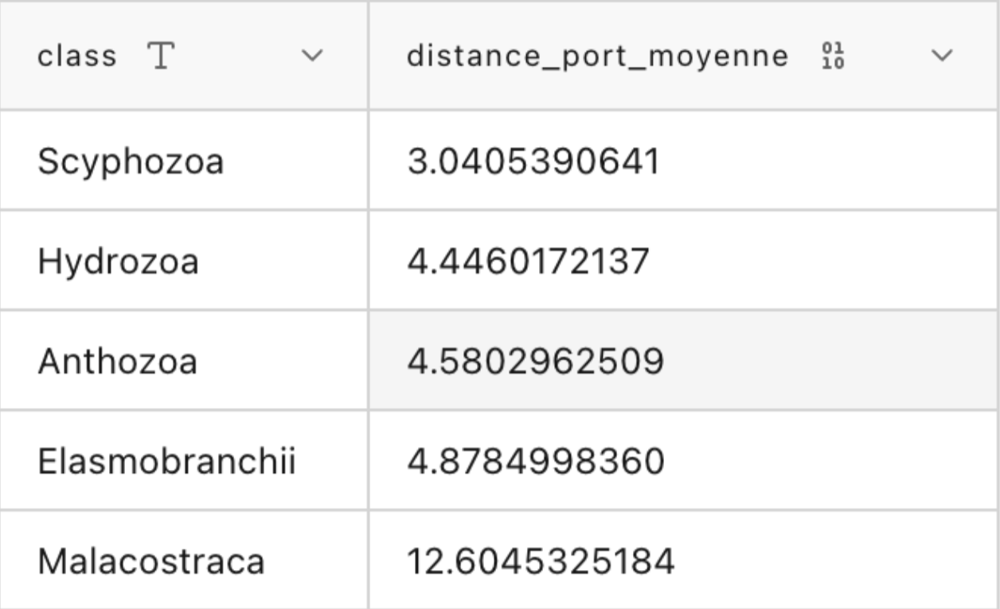{#fig-sql-distance-classe width="6cm" }

### Espèces les plus observées à proximité immédiate des ports

Identification des espèces les plus fréquentes dans les zones très proches des ports (classe 10).

```sql
SELECT species, COUNT(*) AS nb_observations
FROM observation_europe
WHERE species IS NOT NULL
  AND classe_distance_port = 10
GROUP BY species
ORDER BY nb_observations DESC
LIMIT 20;
```

### Espèces les plus observées loin des ports

Analyse équivalente pour les zones les plus éloignées des ports (classe 1).

```sql
SELECT species, COUNT(*) AS nb_observations
FROM observation_europe
WHERE species IS NOT NULL
  AND classe_distance_port = 1
GROUP BY species
ORDER BY nb_observations DESC
LIMIT 20;
```

### Nombre d’observations par année

Permet d’étudier l’évolution temporelle du nombre d’observations.

```sql
SELECT `year`, COUNT(*) AS nb_observations
FROM observation_europe
GROUP BY `year`
ORDER BY `year`;
```

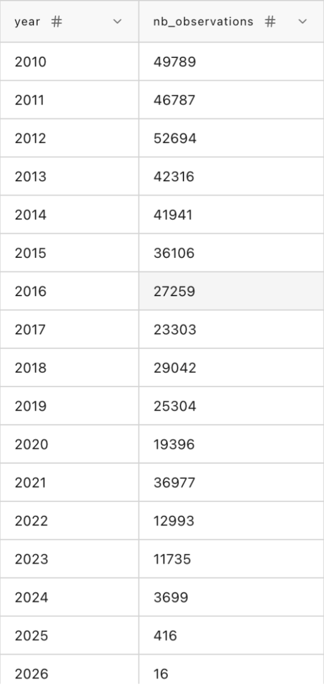{#fig-sql-observations-annee width="5.5cm" }

### Observations situées à une distance inférieure à la moyenne

Sélection des observations plus proches des ports que la moyenne globale.

```sql
SELECT 
    id_observation,
    species,
    distance_port_min
FROM observation_europe
WHERE distance_port_min < (
    SELECT AVG(distance_port_min)
    FROM observation_europe
);
```

### Phylums abondants et proches des ports

Identification des phylums ayant un nombre important d’observations (>= 100) et une distance moyenne faible aux ports.

```sql
SELECT 
    phylum,
    COUNT(*) AS nb_observations,
    AVG(distance_port_min) AS distance_port_moyenne
FROM observation_europe
WHERE phylum IS NOT NULL
GROUP BY phylum
HAVING COUNT(*) >= 100
ORDER BY distance_port_moyenne ASC;
```

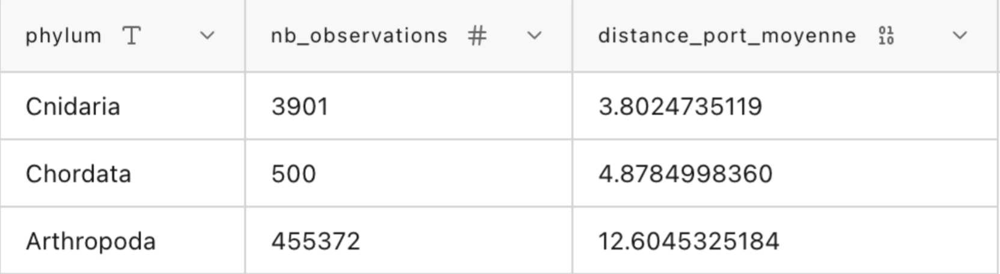{#fig-sql-phylum-abondant width="6cm" }
