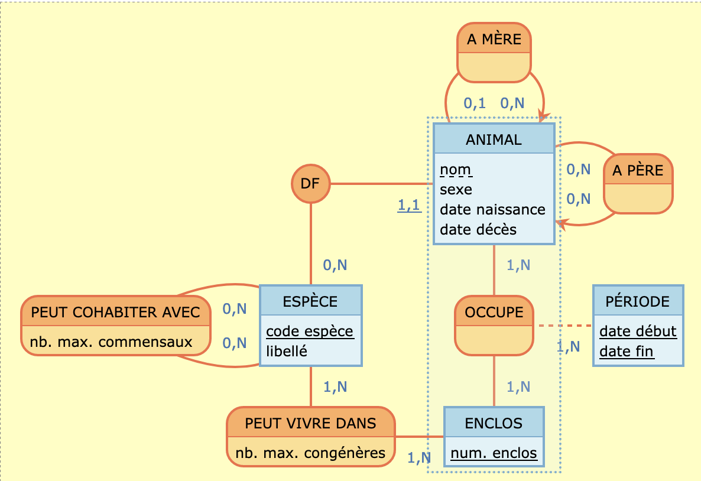

# Introduction {.label:s-intro}

## Contenu d'une introduction

La biodiversité marine est aujourd’hui soumise à de nombreuses pressions humaines, notamment liées aux activités portuaires et aux installations offshore. Les ports concentrent une forte activité maritime, logistique et industrielle, tandis que les infrastructures offshore modifient également les espaces marins. Il est donc pertinent 


\bigskip

\begin{center}

\textbf{Dans quelle mesure la proximité des ports maritimes et des infrastructures offshore influence-t-elle la distribution spatiale des observations de biodiversité marine en Europe ?
}

\end{center}
\medskip 

\justifying

Il est important ensuite de bien motiver l'importance de la (des)
question(s), et leur actualité. Pour qui et en quoi cette question
est-elle importante? Quelles actions pourront être menées si l'on dipose
d'éléments de réponse ?

\medskip

Notez que la question de recherche ci-haut doit servir de fil
conducteur, de guide, tout au long de votre rapport (dans le choix des
données à collecter, des analyses à effectuer, de comment présenter les
résultats, de vos analyses et conclusions, etc.).

\medskip
Nous suggérons que vous organisiez votre rapport en utilisant des
chapitres mais, en fonction de votre projet, rien ne vous empêche
d'adopter une structure différente.


## Responsabilités et composition de l’équipe
Vous devez décrire les principaux rôles de chaque membre du groupe dans l'équipe.

\medskip

Victor HUGO : Étudiant n°XXXX, Resp. de la collecte des données.

Albert ENSTEIN : Étudiant n°XXXX, Resp. du rapport.

....


## Quelques détails techniques


**Ortographe** : Il est important de soigner l'orthographe. Vous devriez utiliser un correcteur en ligne tel que \texttt{languagetool}\footnote{Voir \href{https://www.overleaf.com/blog/635-languagetool-a-free-browser-add-on-to-check-your-grammar-and-spelling}{https://www.overleaf.com/blog/635-languagetool-a-free-browser-add-on-to-check-your-grammar-and-spelling} et \url{https://fr.overleaf.com/learn/how-to/Can_I_change_the_spell_check_language_to_e.g._Spanish\%3F}.} (\url{https://languagetool.org/fr}).

\bigskip

**R Markdown :** Pour créer ce rapport, on vous demande d'utiliser `R Markdown`, via le logiciel `RStudio`.

Pour vous aider, on vous fournit un fichier `.Rmd` qui contient la structure du projet et qui présente quelques exemples de la syntaxe à utiliser. Vous pouvez donc partir de ce fichier et le modifier à votre guise. (Nous suggérons que vous organisiez votre rapport en utilisant des chapitres mais, en fonction de votre projet, rien ne vous empêche d'adopter une structure différente.) 

La «compilation» (_i.e._, «Kniter») du `Rmd` permet de créer soit un fichier PDF, soit un fichier Word, soit un fichier HTML (le PDF étant celui pour lequel les choses se passent le mieux, et aussi le format attendu pour ce cours).

Vous pouvez incorporer des _chunks_ R qui seront exécutés à la volée. Vous pouvez inclure des commandes \LaTeX. 

Le désavantage de travailler avec un `.Rmd` sous `RStudio` est que vous travaillez en local : il faudra donc bien faire attention de prendre en compte les modifications de chacun. 

\bigskip

**Editeur collaboratif : ** Lorsque votre rapport sera proche de sa version finale, i.e. lorsqu'il ne restera que du texte à modifier, vous pourrez utilier le logiciel Overleaf (https://overleaf.com) pour collaborer avec les autres membres de votre équipe directement sur la version \LaTeX\ de ce document (qui est un sous-produit créé quand vous cliquez sur Knit depuis RStudio).

\bigskip


**Figure : ** Pour inclure une figure, il faut qu'elle ait une légende (ce qui est le cas pour la Figure$~$\ref{myfigure} ci-après) et qu'elle soit référencée quelque part dans le document (ce qui est le cas dans les parenthèses qui précédent). 


{#myfigure width="4cm" height="2cm"}

\bigskip

**Tableau** : 
Notez que contrairement à une figure, la légende d'un tableau doit être mise **au-dessus** de celui-ci (_e.g._, voir la Table$~$\ref{tab7.1} ci-dessous). Comme pour les figures, tout tableau doit également être discuté dans le texte du rapport.

Utiliser https://www.tablesgenerator.com/markdown_tables pour créer des tables Markdown simples, ou bien utiliser \LaTeX. Plus de précisions sur l'utilisation des tableaux sont données en Annexe

| Les tables   |        sont       |  cool |
|--------------|:-----------------:|------:|
| col 1 est    |  alignée à gauche | $1600 |
| col 2 est    |     centrée       |   $12 |
| col 3 est    | alignée à droite  |    $1 |

library(knitr)


``` r
install.packages("knitr")
library(knitr)
# Créer un tableau simple avec kable
df <- data.frame(Nom = c("Alice", "Bob"), Age = c(25, 30))
kable(df, format = "latex") # Peut aussi être "html", "latex"
```

Table: une légende au-dessus du tableau. \label{tab7.1}

\begin{table}[h]
    \centering
    \begin{tabular}{|c|c|c|}
        \hline
        Nom & Âge & Ville \\
        \hline
        Alice & 25 & Paris \\
        Bob & 30 & Lyon \\
        Charlie & 22 & Marseille \\
        \hline
    \end{tabular}
    \caption{Exemple de tableau en LaTeX}
    \label{tab:exemple}
\end{table}

# Base de données

## Provenance des données

Donner ici le ou les \textbf{lien}(s) vers le(s) jeu(x) de données que vous avez
utiliser pour votre travail et présenter les rapidement. 


\bigskip

  Dans le jeu de données récupéré, expliquer pourquoi vous avez sélectionné certaines tables ou pourquoi vous en avez rajouté. Vous devez indiquer comment les données sont stockées (le format csv, txt...), la taille des fichiers, le nombre de lignes et de colonnes, \ldots{}

\bigskip

  Expliquer quels choix vous avez réalisés pour filtrer les lignes et les colonnes (éventuellement réduire le périmètre du projet) et décrire les critères de sélection (e.g., ne garder que 5 colonnes sur les 15, ne garder que les lignes qui correspondent à une ville en particulier, \ldots).

\bigskip

  Finalement, définir
clairement quelle est la \textbf{population étudiée}. Vous devez 
expliquer quelles données vous avez utiliser et en quoi elles peuvent
permettre d'apporter des éléments de réponses aux questions posées. Bien
définir quelles sont les \textbf{unités statistiques}.


## Descriptif des tables

Pour chaque table conservée, préciser le nombre de lignes et de colonnes après filtrage, lister les colonnes et donner pour chacune le type, la signification du champ et des caractéristiques (unique, clés, valeur manquante, ...) en remplissant le tableau ci-dessous.

| Nom colonne | Type | Signification | Caractéristique |
|:-----------:|:----:|:-------------:|:---------------:|
|             |      |               |                 |

Table: Nom de la table (nombre de lignes $\times$ nombre de colonnes)


## Modèles MCD et MOD

- Pour le MCD, inclure une image réalisée avec le logiciel Mocodo [https://www.mocodo.net/] telle que celle visible sur la Figure$~$\ref{uml} ci-dessous :

  {#uml width="8cm" height="4cm"}

- Pour le MOD, inclure une image réalisée avec le designer de phpmyadmin

\bigskip

Noter en passant qu'il est possible de créer des diagrammes en R Markdown au moyen du package `DiagrammeR` [\url{https://rich-iannone.github.io/DiagrammeR/graphviz_and_mermaid.html}] comme on peut le voir ci-dessous.


``` r
# install.packages("webshot",dependencies = TRUE)
# library(webshot)
# webshot::install_phantomjs()
Sys.setenv(OPENSSL_CONF="/dev/null")
DiagrammeR::grViz("
digraph boxes_and_circles {

  # a 'graph' statement
  graph [overlap = true, fontsize = 10]

  # several 'node' statements
  node [shape = box,
        fontname = Helvetica]
  A; B; C; D; E; F

  node [shape = circle,
        fixedsize = true,
        width = 0.9] // sets as circles
  1; 2; 3; 4; 5; 6; 7; 8

  # several 'edge' statements
  A->1 B->2 B->3 B->4 C->A
  1->D E->A 2->4 1->5 1->F
  E->6 4->6 5->7 6->7 3->8
}
")
```

```{=html}
<div class="grViz html-widget html-fill-item" id="htmlwidget-c035b06903d648426f83" style="width:468px;height:10cm;"></div>
<script type="application/json" data-for="htmlwidget-c035b06903d648426f83">{"x":{"diagram":"\ndigraph boxes_and_circles {\n\n  # a \"graph\" statement\n  graph [overlap = true, fontsize = 10]\n\n  # several \"node\" statements\n  node [shape = box,\n        fontname = Helvetica]\n  A; B; C; D; E; F\n\n  node [shape = circle,\n        fixedsize = true,\n        width = 0.9] // sets as circles\n  1; 2; 3; 4; 5; 6; 7; 8\n\n  # several \"edge\" statements\n  A->1 B->2 B->3 B->4 C->A\n  1->D E->A 2->4 1->5 1->F\n  E->6 4->6 5->7 6->7 3->8\n}\n","config":{"engine":"dot","options":null}},"evals":[],"jsHooks":[]}</script>
```


## Import des données 

- Préciser les nettoyages réalisés avant l'import comme l'uniformisation des valeurs des champs (_e.g._, Mr, M., Monsieur, ...) ou le remplissage des valeurs manquantes par une valeur moyenne ...

\begin{itemize}
    \item  Source de données 1 :
    \begin{itemize} 
     \item Suppression des colonnes XXX, car XXX
     \item  Suppression des doublons dans les colonnes XXX
    \item  Filtrage en fonction de la colonne XXx, nous n'avons conservé que.... 
\end{itemize}
\end{itemize}


## Requêtes réalisées


Pour chaque requête, l'exprimer en langage naturel puis en SQL. Puis donner le résultat obtenu (ou un extrait) et expliquer ce résultat.

L'objectif est de varier le type de requêtes et de répondre à votre problématique initiale.

## Quelques détails techniques


On peut interagir avec une base de données directement depuis RMarkdown : i.e. requêter puis récupérer et afficher le résultat directement depuis le .Rmd. Un fichier connexionBDD.Rmd est fourni pour donner des exemples.

# Matériel et Méthodes

## Logiciels

Lister tous les logiciels utilisés pour la partie statistique du rapport (et également ceux pour gérer et communiquer entre les membres du projet s'il y en a en particulier)

\medskip

R (ou Python) est le logiciel à privilégier pour la Science des Données. Pour assurer une reproductibilité maximale, vous devriez utiliser R Markdown (ou un Notebook Jupyter, et éventuellement un outil de gestion des versions tel que `Git`), par exemple via Google Colab ou RStudio dans les nuages. Évitez d'utiliser Word!

\bigskip

Il est de votre responsabilité de donner les versions des logiciels que vous utilisez, ainsi que de donner des informations techniques sur l'ordinateur qui vous a servi pour les analyses (système d'exploitation, vitesse du processeur, etc.). Penser à fournir des citations pour les logiciels utilisés, par exemple \footnote{L'entrée BibTeX ajoutée dans le fichier \texttt{references.bib} a été obtenue grâce à la commande  \texttt{citation(package = "tidyverse")} tapée dans la console de R.}.
 


## Modélisation statistique

Quels outils ou méthodes de statistiques allez-vous utiliser? Donner des équations mathématiques s'il y a lieu et lister les éventuels présupposés («assumptions» en anglais) que vous devez faire sur les données afin d'utiliser ces outils ou méthodes (_e.g._, normalité, absence de valeurs aberrantes, etc.).

Il est également bon d'indiquer quelles sont les avantages et les limites de ces méthodes.

Vous pourrez consulter avec profit les Chapitre 11--13 du livre sur R :

<http://biostatisticien.eu/springeR/livreR.pdf>

# Analyse Exploratoire des Données

Toute étude impliquant des données doit **obligatoirement** inclure une analyse exploratoire préalable. Celle-ci permet de mieux comprendre l'information contenue dans les données.

Il faut produire de nombreux résumés graphiques (_e.g._, histogrammes, nuages de points, boxplots, etc.) et numériques (_e.g._, médiane, moyenne, variance, etc.). Ainsi, il faut faire une analyse descriptive uni- et bivariée systématique de toutes les variables du jeu de données. Puis, il faut uniquement conserver les plus pertinents (les autres pouvant être gardés en Annexe), c'est-à-dire ceux qui permettront de dégager des éléments de réponse pour la question de recherche envisagée.  Chaque figure et tableau doit être commenté. Mais il ne faut pas extrapoler et dire des choses qui ne sont pas visibles dans ces graphiques ou tableaux. Pour chaque analyse, vous pourrez préciser le nombre d'individus/ d'unités statistiques concernés au total.

Vous pourrez consulter avec profit le Chapitre 9 du livre sur R :

<http://biostatisticien.eu/springeR/livreR.pdf>

## Utiliser R {.fragile}

Il est facile d'inclure des codes R dans votre rapport, qui seront exécutés à la volée (_i.e._, lors de la traduction de votre fichier `Rmd` en fichier `PDF` ou `DOC`). Par exemple:


``` r
boxplot(cars, col = c("#5975a4", "#cc8963"))
```

\begin{figure}

{\centering \includegraphics[width=7cm]{scdon2-UPV-report-template_files/figure-latex/unnamed-chunk-3-1} 

}

\caption{\label{fig:boxplots}Deux boxplots.}\label{fig:unnamed-chunk-3}
\end{figure}

``` r
colMeans(cars)
```

```
## speed  dist 
## 15.40 42.98
```


Les lignes de code ne doivent pas dépasser dans la marge de droite. Ainsi on pourrait remplacer le chunk ci-dessous:


``` r
boxplot(cars, main = "Un titre qui est vraiment beaucoup trop long et qui dépasse dans la marge de droite")
```

\begin{figure}

{\centering \includegraphics[width=7cm]{scdon2-UPV-report-template_files/figure-latex/unnamed-chunk-4-1} 

}

\caption{Pas super.}\label{fig:unnamed-chunk-4}
\end{figure}

par celui-ci:

\tiny


``` r
boxplot(cars, 
        main = "Un titre qui est vraiment beaucoup trop long\n mais qui ne dépasse plus dans la marge de droite")
```

\begin{figure}

{\centering \includegraphics[width=7cm]{scdon2-UPV-report-template_files/figure-latex/unnamed-chunk-5-1} 

}

\caption{Déjà mieux.}\label{fig:unnamed-chunk-5}
\end{figure}

\normalsize

où l'on a:

- utilisé la commande \LaTeX\ `\tiny` pour changer la taille de la police (suivi de de `\normalsize` pour revenir à la taille normale), 
- mis l'instruction `main = ...` sur la deuxième ligne,
- utilisé `\n` pour afficher le titre sur deux lignes.

\vspace{3em}

**Remarques** : Contrairement aux graphiques précédents, nous vous demandons, pour effectuer les graphiques, d'utiliser le package `ggplot2`. Voir [https://juba.github.io/tidyverse/08-ggplot2.html](https://juba.github.io/tidyverse/08-ggplot2.html) pour une courte introduction.

# Inférence statistique et modélisation

Dans cette partie, vous pourrez utiliser les outils et méthodes vus au semestre précédent pour analyser les liens entre les variables. 

Pour cela, vous pourrez utiliser les tests du $\chi^2$, test du coefficient de corrélation linéaire, test d'Anova, la droite de régression linéaire.

Vous pourrez également proposer des modèles pour faire du clustering (k-means, CAH), de la classification (K plus proches voisins par exemple) comme vu en Science des données 1.  

## La droite de régression linéaire : un premier exemple

Si on souhaite expliquer les variations d'une variables réponse $Y$ en fonction d'un certain nombre de prédicteurs $x_1,\ldots,x_p$, on peut utiliser un modèle de régression linéaire simple ($p=1$) ou multiple ($p>1$)

$$
Y_i = \beta_0 + \beta_1 x_{1i} + \cdots +\beta_p x_{pi} + \epsilon_i, \qquad i=1,\ldots,n.
$$
où l'on présuppose que les $\epsilon_i$ sont i.i.d.\ $N(0,1)$ pour tout $i=1,\ldots,n$ ($n$ étant la taille de l'échantillon).

Vous pourrez toujours consulter avec profit les Chapitre 11--13 du livre sur R :

<http://biostatisticien.eu/springeR/livreR.pdf>

Ces chapitres détaillent l'utilisation de certains tests et modèles sous `R`.

# Discussion

Placer les résultats que vous avez obtenus dans le chapitre précédent en perspective par rapport au problème étudié.

# Conclusion et perspectives {.label:ccl}

Quelles sont les conclusions principales? Quelles sont vos recommandations pour le commanditaire? Quelles analyses subséquentes pourraient être faites dans le futur?

\bigskip

On attend de vous deux types de perspectives : des perspectives à court terme pour améliorer rapidement votre approche et des perspectives à plus long terme qu'elles soient liées à la science des données ou au domaine métier pour lequel vous avez travaillé.

\bigskip

Lister également les difficultés rencontrées dans la partie BD (e.g., taille de la base, manque de données, ...) et dans la partie statistique.

# Bibliographie {-}

<div id="refs"></div>

\bibliographystyle{elsarticle-harv}
\bibliography{references}

# Annexes {-}


Il faut utiliser les annexes de façon judicieuse. C'est ici que l'on place des résultats trop volumineux pour apparaître dans le corps du rapport. Ou bien des résultats (e.g., graphiques) moins intéressants que les autres. Cela permet de limiter le nombre de pages du coeur du rapport, et d'ajouter des détails dans cette partie pour le lecteur désireux d'en savoir plus.

## **Codes** {-}

Ajouter vos codes informatique ici. Les codes doivent être correctement indentés et commentés.

## **Tables** {-}

Si vous avez des tableaux supplémentaires, vous pouvez les ajouter ici.

Utiliser https://www.tablesgenerator.com/markdown_tables pour créer des tables Markdown simples, ou bien utiliser \LaTeX.

1. Table Markdown

| Les tables   |        sont       |  cool |
|--------------|:-----------------:|------:|
| col 1 est    |  alignée à gauche | $1600 |
| col 2 est    |     centrée       |   $12 |
| col 3 est    | alignée à droite  |    $1 |

Table: une légende au-dessus du tableau. \label{tab7.1}

Aligner les nombres de la troisième colonne sur la droite permet d'afficher les unités au-dessus des unités, les dizaines au-dessus des dizaines, etc. Il faut toujours privilégier cette présentation.

\vspace{3em}

2. Table Latex

\begin{table}[h]
\centering
\caption{une légende au-dessus du tableau}
\label{tab7.1}
\begin{tabular}{lcr}
\hline
Les tables & sont & cool \\
\hline
col 1 est & alignée à gauche & 1600 \\
col 2 est & centrée & 12 \\
col 3 est & alignée à droite & 1 \\
\hline
\end{tabular}
\end{table}


\textbf{Remarques}

\begin{itemize}
  \item \{lcr\} : gauche (l), centré (c), droite (r)
  \item \verb|\caption| place la légende au-dessus
  \item \verb|\label| permet de référencer le tableau (\verb|\ref{tab7.1}|)
  \item Les nombres sont bien alignés à droite dans la 3\ieme{} colonne
\end{itemize}
